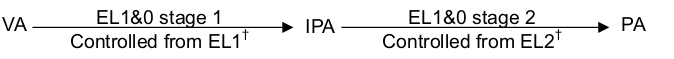

# VMSAV8简介

---

| 软件版本  | 硬件版本 | 更新内容 |
|---------|--------|----------|
|linux 4.14| armv8-64   |   first     |

---
VMSA即Virtual Memory System Architecturer的缩写，中文为虚拟内存系统架构。VMSA提供一个内存管理单元(MMU)，用于控制地址转换、访问权限和内存属性的确定和检查。地址转换就是将虚拟地址(VA)映射到物理地址(PA)。VA到PA的映射需要一个单独的翻译阶段，或者两个连续的翻译阶段，也就是stage。

## 0 VMSAV8命名
1. VMSAv8-32　运行在AArch32模式下的地址转换，可能存在一个stage或者两个连续的stage.
2. VMSAv8-64　运行在AArch64模式下的地址转换，可能存在一个stage或者两个连续的stage.
3. VMSAv8　通指以上两种。

## 1 VMSAV8地址类型和地址空间

### 1.1 VA
VA也就是Virtual address虚拟地址缩写。在V8中最大支持48bit 的地址宽度。
地址范围从0x0000 0000 0000 0000 到 0x0000 FFFF FFFF FFFF
:::　tip
在ARMv8.2-LVA中，52bits地址宽度的地址将被支持。
:::

### 1.2 IPA
IPA即Intermediate physical address的缩写，在一次虚拟地址到物理地址的转换过程中，可能会包括两个stage,那第么IPA就是stage1的输出，stage2的输入，它是一个中间产物。如下图所示：

### 1.3 PA
PA即Physical address的缩写，就是物理地址，也就是直正的地址总线编址的地址。

## 2 地址标签
在内核文档Memory Layout on AArch64 Linux中有如下表述：
::: tip 
User addresses have bits 63:48 set to 0 while the kernel addresses have the same bits set to 1. TTBRx selection is given by bit 63 of the virtual address. The swapper_pg_dir contains only kernel (global) mappings while the user pgd contains only user (non-global) mappings. The swapper_pg_dir address is written to TTBR1 and never written to TTBR0.
:::
也就是内核把VA空间分为两段：
- 0x0000 0000 0000 0000 到　0x0000 FFFF FFFF FFFF　为user地址空间
- 0xFFFF 0000 0000 0000 到　0xFFFF FFFF FFFF FFFF　为内核空间

这样的全部的地址空间就是256T+256T，这和我们之前说的最大48bits地址总线宽度256T的空间不一致，其实很简单，原因就是有两个页表基址寄存器：TTBR1和TTBR0.

在看一下arm参考手册中的描述
::: tip
For addresses when stage 1 translation can support two VA ranges
:::

| VA[55] | 描述 |
|--------|--------|
|0|  如果使能了 stage 1 的转换, 那么 TCR_ELx.TBI0 控制是否启用 address tags 功能.寄存器 TTBR0_ELx 保存地址转换表的基地址.|
|1|如果使能了 stage 1 的转换, 那么 TCR_ELx.TBI1 控制是否启用 address tags 功能. 寄存器 TTBR1_ELx 保存地址转换表的基地址.|

基本上也是一个意思。关于地址标签，就了解这些还有一些其他的信息，可以参考手册。

## 4 小结
本文介绍了VMSAv8的一些基本信息，有一点就是我们关注的更多的是和软件关系密切的部分，其实的部分大家可以通过arm参考手册了解。

:::　tip 参考文件  

[ARMv8_white_paper_v5](https://www.arm.com/zh/files/downloads/ARMv8_white_paper_v5.pdf)

[Armv8-A architecture profile ](https://silver.arm.com/download/ARM_and_AMBA_Architecture/AR150-DA-70000-r0p0-07eac0/DDI0487E_a_armv8_arm.pdf)

[Memory Layout on AArch64 Linux](https://www.kernel.org/doc/html/latest/arm64/memory.html)

:::

---
::: tip  

转载请注明出处！ [探索者](http://www.cxy.wiki)

:::

