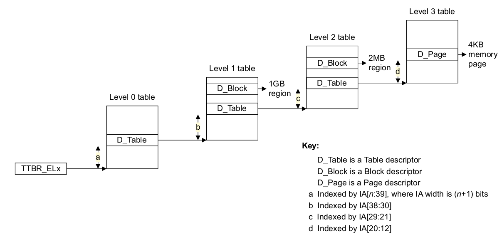
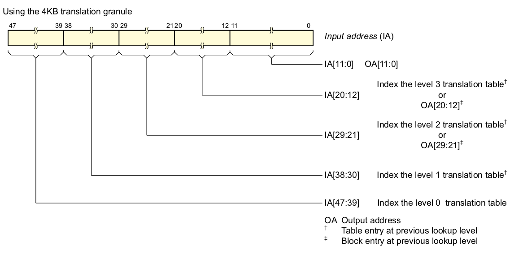
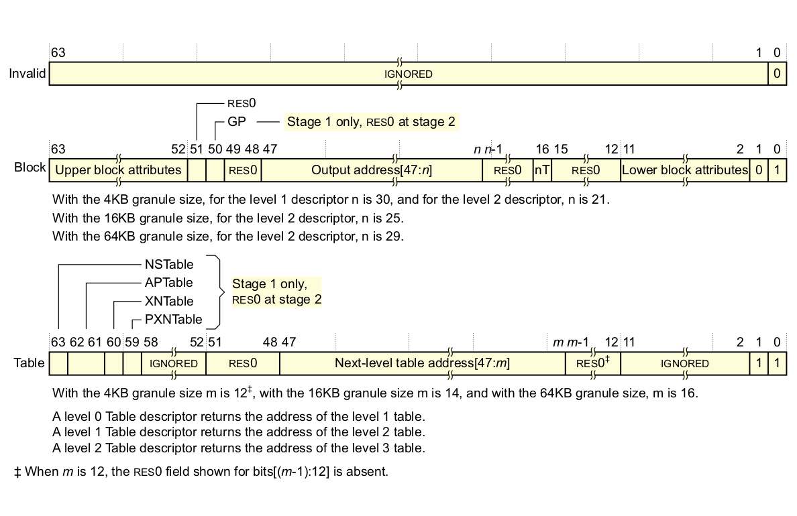
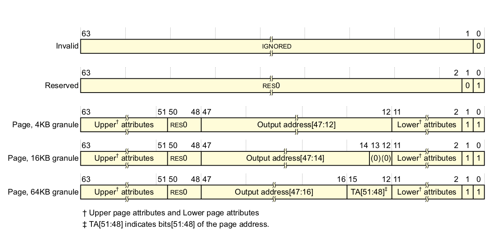
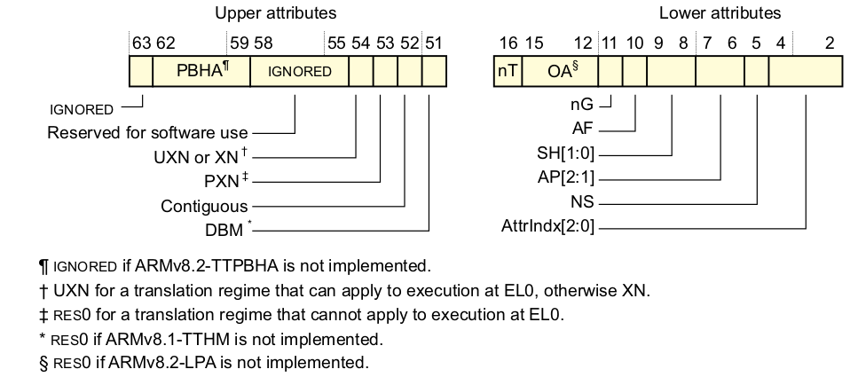

# VMSAv8页表

---

| 软件版本  | 硬件版本 | 更新内容 |
|---------|--------|----------|
|linux 4.14| arm64   | first       |

---

::: tip
在本文中，我们只关注地址总线宽度为48bits,页面大小为4k的情况，其它情况请自行参考arm手册。
:::
## 0 什么是页表
在我们读书的时候，比如我们要读数学书的第三章第四小节的内容，我会可能会按如下操作进行：
1. 找到数学书
2. 打开目录找到第三章
3. 在第三章里找到第四小节对应的页码X
4. 打开书的第X页
5. 读取内容

当读取内存的数据也是同样方式，只不过查的不是目录而是页表，具体如下图所示

1. 先从TTBR中拿到页表的基地址Ａ，也就是相当于先找到书
2. Ａ加上IA[47:39]偏移找到在level0中的页表项也是下一级页表基地址Ｂ， 相当于找章的过程
3. Ｂ再加IA[38:30]偏移找到在level1中的页表项也就是下一级页表基地址Ｃ，还是相当找章的过程
4. Ｃ再加IA[29:21]偏移找到在level2中的页表项也就是下一级页表基地址Ｄ，还是相当找章的过程
5. Ｄ再加IA[20:12]偏移找到在level3中的页表项，这个项也就一个4k页的基地址Ｅ，还是相当找章的过程
6. Ｅ再加IA[11:0 ]偏移找到在就找到一个页内物理地址Ｆ
7. 读取物理地址Ｆ的值


## 1 输入地址

输入地址（IA）大致情况如下图所示：

说明：
- IA[47:39]　level0页表索引
- IA[38:30]　level1页表索引
- IA[29:21]　level2页表索引，如果是块映射，那个这几个bit将做为OA[29:21]
- IA[20:12]　level3页表索引，如果是块映射，那个这几个bit将做为OA[20:12]
- IA[11:00]　页内偏移，也就是输出地址的OA[11:00]

以上这个表基本和内核文档中的表述是一致的
```
+--------+--------+--------+--------+--------+--------+--------+--------+
|63    56|55    48|47    40|39    32|31    24|23    16|15     8|7      0|
+--------+--------+--------+--------+--------+--------+--------+--------+
 |                 |         |         |         |         |
 |                 |         |         |         |         v
 |                 |         |         |         |   [11:0]  in-page offset
 |                 |         |         |         +-> [20:12] L3 index
 |                 |         |         +-----------> [29:21] L2 index
 |                 |         +---------------------> [38:30] L1 index
 |                 +-------------------------------> [47:39] L0 index
 +-------------------------------------------------> [63] TTBR0/1

```

## 2 页表项
### 2.1  level 0,1,2页表的项

我们主要讨论Table且m=12的页表项,逐个bit说明，其他的自行参考arm手册
- BIT[0],0表示无效的项，1表示有效的项
- BIT[1],0表示输出地址为一个块地址，１表示输出地址为下一级table基地址
- BIT[11:2],忽略
- BIT[47:12],输出地址
- BIT[51:48],RES0
- BIT[52:58],忽略
- BIT[59],定义了后续 lookup 操作的 PXN 属性
- BIT[60],定义了后续 lookup 操作的 XN 属性
- BIT[62:61],定义了后续 lookup 操作的访问权限控制位 (Access permissions)
- BIT[63],Non-secure state 下的内存访问, bit[63] 没有意义
### 2.2  level 3页表的项


这里主要关注bit[47:12],这些bit再加上IA[11:0]就是最终的物理地址。
- BIT[0],0无效项，1表示有效
- BIT[1],0与bit[0]一样，1表示包含了 4KB、16KB 或者 64KB page 的地址和属性信息
- BIT[11:2],属性
- BIT[47:12],这些bit再加上IA[11:0]就是最终的物理地址
- BIT[50:48],RES0
- BIT[63:51],属性

关于属性见下面的表述

这里的Upper attributes和Lower attributes就是上图中的bit[63:51],bit[11:2],
- BIT[4:2],该 bit 为 Stage 1 memory attributes index,即 MAIR_ELx
- BIT[5],Non-secure,用于指示在 Secure state 下发起的内存访问的 translation 的 output address 指向 Secure world 还是 Non-
secure world
- BIT[7:6],该 bit 为 Data Access Permissions
- BIT[9:8],该 bit 为 Shareability field
- BIT[10],该 bit 为 Access flag
- BIT[11],该 bit 为 not global,当 entry 被加载到 TLB 时,该 bit 用于指示 TLB entry 是属于当前 ASID 还是属于所有的 ASID
- BIT[52],该 bit 用于指示 translation table entry 是否属于 contiguous set or entries
- BIT[53],该 bit 为 Privileged execute-never,决定了 descriptor 所指向的 region 在 EL1 中是否 executable
- BIT[54],该 bit 为 Execute-never,决定了 descriptor 所指向的 region 是否 executable
- BIT[58:55],忽略
- BIT[62:59],PBHA
- BIT[63],忽略

## 小结
以上就是对VMSAv8页表的描述，更多的信息请自行参考arm手册。


---
:::　tip 参考文件

[ARMv8_white_paper_v5](https://www.arm.com/zh/files/downloads/ARMv8_white_paper_v5.pdf)

[Armv8-A architecture profile ](https://silver.arm.com/download/ARM_and_AMBA_Architecture/AR150-DA-70000-r0p0-07eac0/DDI0487E_a_armv8_arm.pdf)

[Memory Layout on AArch64 Linux](https://www.kernel.org/doc/html/latest/arm64/memory.html)

:::

---
::: tip  

转载请注明出处！ [探索者](http://www.cxy.wiki)

:::


