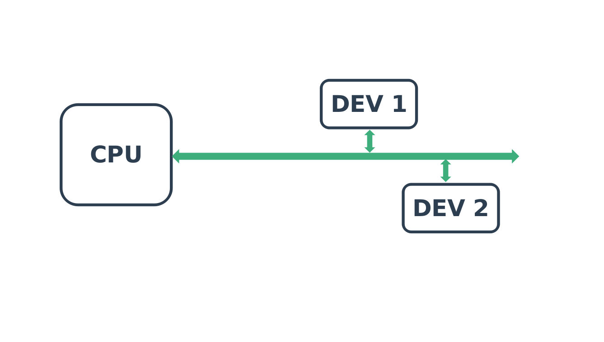
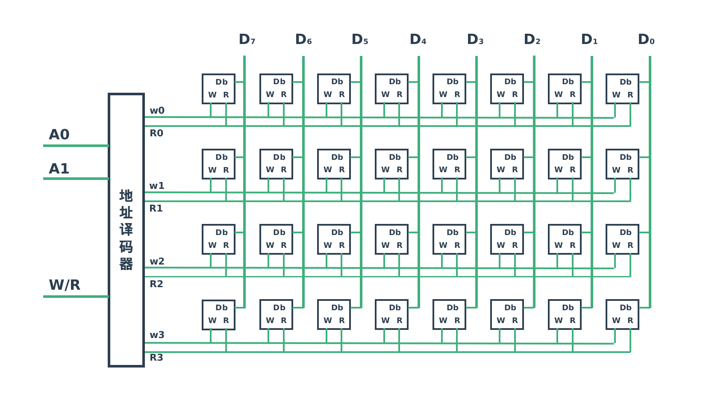

# 简介

---

| 软件版本     | 硬件版本 | 更新内容 |
|--------------|----------|----------|
| linux 5.8.18 |          |          |

---
## 1. 硬件的样子

如上图所示，地址总线一般从`CPU`的引脚发出，连接到一些外围设备，这里一定的注意的是，地址总线上挂载的不只有内存，任何一个可以被`CPU`直接寻址的设备都会挂载到`CPU`的地址总线上，比如X86平台显卡设备，PCI设备，再比如ARM平台的片上外围器件，如`I2C`控制器等。
## 2. 地址空间的形成
如果你有数字逻辑电路的知识，应该很好理解地址的形成,如下图所示：

上图是一个简易的存储器芯片的译码器部分，这个存储器可以存储4个字节的数据,那个需要的地址线就是两根`A0`,`A1`,原因也很好理解，每个根地址线可以有两种状态，高电平和低电平，对应表示`0`，`1`,那个两根地址线组合之后会有4种状态，所以可以选择读取或者写入4个字节的数据。
从上面的这个简易的存储器我们就可以得到地址空间的概念，也就是所有的地址线的排列组合，也就从0到$n^2-1$。这个空间和外围挂载多少设备，什么样的设备没有任何关系，它就是一个CPU可以寻址的范围。
## 3. 编址方式
### 3.1 统一编址
每一种编址方式就是统一编址，也就是所有的设备共享同一个地址空间，典型的就是`ARM`平台。
统一编址的情况IO端口数目不受限制，而且CPU也无需产生存储器或者IO操作的控制信号，但同时
引入的问题就是地址译码器相对比较复杂，而且IO端口常常会占用内存的一部分(当然一般的平台IO端口所需要的地址空间很少，比如`X86 IA32`平台也就是`64K`)。

### 3.2 独立编址
独立编址主要在`X86`平台中使用，主要是指`IO`与`存储器`分别有自己的地址总线，访问时相与不存在任何关系，这种方式最大的好处就是`IO`端口不占用存储器空间，但这种方式需要特殊的IO访问指令，比如`in`,`out`指令。

## 4. 地址空间的划分
地址空间的划分是指把整个空间划分为多个区域，每个区域对应一个设备。
### 4.1 通过硬连线来划分
这种方式在一般简单的嵌入式系统中经常使用，也就是存储器设备会连接到不同的地址总线上或片选信号线上（本质上片选信号线也是一种地址表示形式),这样就从硬件上决定了各个设备的基址就是不同的。典型的案例就是三星嵌入式处理器`S3C2440`平台，存储器区域分为8个`bank`,每个bank基址不同，详细的可以参考`S3C2440`手册。

### 4.2 通过软件来划分
这种方式就是在系统启动初期会形成地址映射表,地址映射表决定的地址的接收设备，典型的就是`X86`平台。在`X86`平台会有一个`北桥芯片`，`CPU`所有的地址访问，都会通过`前端总线`发送给`北桥芯片`,`北桥芯片`再通过`地址映射表`决定地址转发给`显卡`，`内存`还是`PCI`。

::: warning 注意
这里地址映射表不是内核中的虚拟地址映射表，它仅仅存在于`北桥芯片`芯片中，一般由BOIS生成。
:::

## 5. 小结
本文从宏观的角度讨论了计算机系统的地址空间基本原理，当然每一个具体的芯片可能有它自己对地址空间的规划，具体参考芯片手册。

---
::: tip 提示

欢迎评论、探讨,如果发现错误请指正。转载请注明出处！ [探索者](http://www.tsz.wiki) 

:::

---
<Vssue :title="$title"/>
