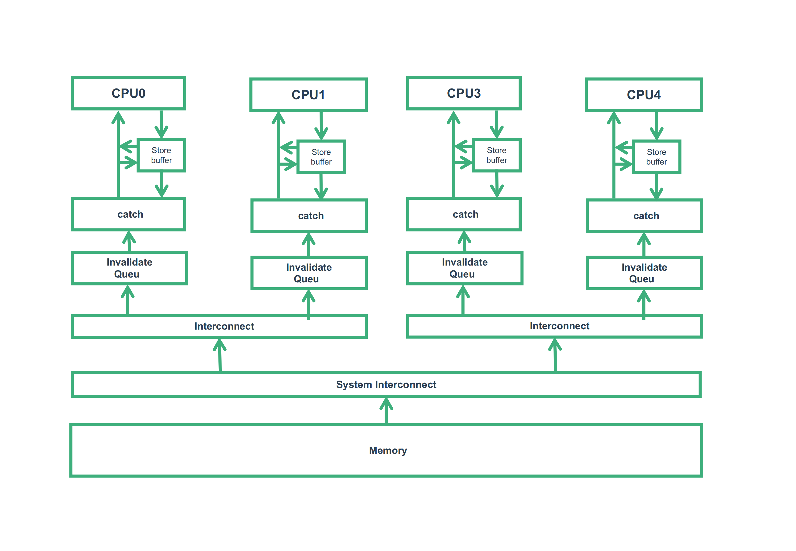

# 原理
在内存屏障概述中，我们已经对内存屏障有了大概的了解，也清楚了它的接口，本节主要来了解一下它的原理。

---

| 软件版本  | 硬件版本 | 更新内容 |
|---------|--------|----------|
|         |        |          |

---

## 1 硬件的样子

CPU经过长时间的发展，硬件构成等各方面都有了很大变化的，现代CPU的样子应该如下图所示：

---
::: tip  

转载请注明出处！ [探索者](http://www.cxy.wiki)

:::

---
<Vssue :title="$title"/>
