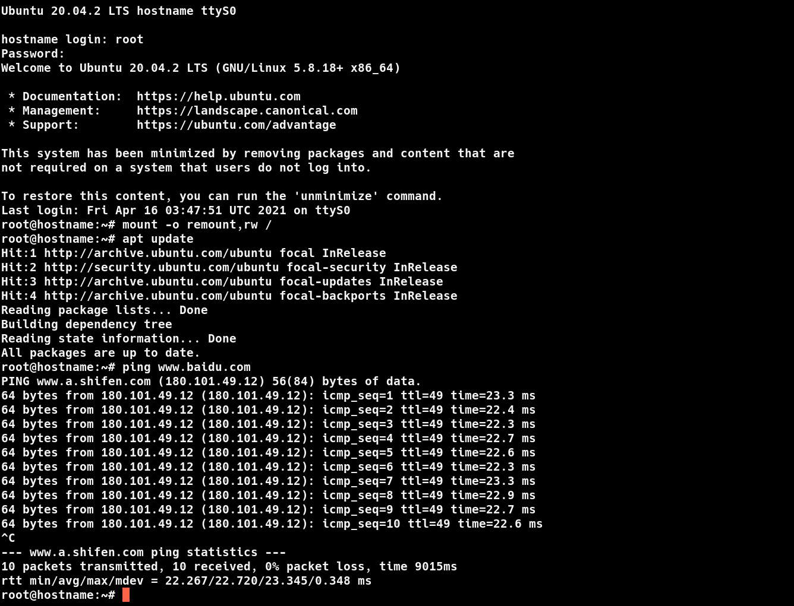

# 制作UBUNTU根文件系统

---

| 软件版本  | 硬件版本 | 更新内容 |
|---------|--------|----------|
|ubuntu20.04| amd64   |        |

---

## 1.概述
之前的文章我们介绍过[根文件系统原理](https://www.tsz.wiki/linux/filesystem/initrd-principles/initrd-principles.html),但是我们使用的 `rootfs` 是根据`busybox`制作来出的，但是这个`rootfs`过于简单，还有很多功能是没有的，今天基于`ubuntu`提供的base包来制作一个比较完善的`rootfs`,具备`apt install`、`systemd`等功能。

## 2.制作 

### 2.1 获取基础包
从[这里](http://cdimage.ubuntu.com/ubuntu-base/releases/),可以下载到各个版本的`ubuntu base`包，这里我用`20.04`为例，通过下面的方式来下载：
```sh
wget http://cdimage.ubuntu.com/ubuntu-base/releases/20.04/release/ubuntu-base-20.04.1-base-amd64.tar.gz
```
之后解压到`base`目录：
```sh
mkdir base
tar -xvf ./ubuntu-base-20.04.1-base-amd64.tar.gz -C base
```
解压之后如所示，这就是最初的包，其实里面已经有很多功能，比如软件安装功能等等

```sh
ls ./base
bin  boot  dev  etc  home  lib  lib32  lib64  libx32  media  mnt  opt  proc  root  run  sbin  srv  sys  tmp  usr  var

```


### 2.2 配置

1. 配置DNS,这里我们直接我电脑里的解析文件，我这边是`ubuntu`,DNS文件在`/etc/resolv.conf`
```sh
cp /etc/resolv.conf ./base/etc

```
2. 切换系统根目录
通过下面的指令就可以切换系统根目录到`base`目录
```sh
sudo chroot base /bin/bash
```
::: tip Tip 
后面加 `/bin/bash` 是因为我使用的`shell`是`zsh`,而 `base` 包里本身不含有 `zsh`
:::
这样我们就成功切换根目录，如下
```sh
root@M:/# ls
bin  boot  dev  etc  home  lib  lib32  lib64  libx32  media  mnt  opt  proc  root  run  sbin  srv  sys  tmp  usr  var
root@M:/#

```
之后执行`apt update`，准备安装软件

你可能会遇到如下错误
```sh
root@M:/# apt update
Get:1 http://archive.ubuntu.com/ubuntu focal InRelease [265 kB]
Get:2 http://security.ubuntu.com/ubuntu focal-security InRelease [109 kB]
Err:2 http://security.ubuntu.com/ubuntu focal-security InRelease
  Couldn't create temporary file /tmp/apt.conf.HeoxFW for passing config to apt-key
Err:1 http://archive.ubuntu.com/ubuntu focal InRelease
  Couldn't create temporary file /tmp/apt.conf.t765yW for passing config to apt-key
Get:3 http://archive.ubuntu.com/ubuntu focal-updates InRelease [114 kB]
Err:3 http://archive.ubuntu.com/ubuntu focal-updates InRelease
  Couldn't create temporary file /tmp/apt.conf.I7juzX for passing config to apt-key
Get:4 http://archive.ubuntu.com/ubuntu focal-backports InRelease [101 kB]
Err:4 http://archive.ubuntu.com/ubuntu focal-backports InRelease
  Couldn't create temporary file /tmp/apt.conf.oD5jt5 for passing config to apt-key
Reading package lists... Done
W: GPG error: http://security.ubuntu.com/ubuntu focal-security InRelease: Couldn't create temporary file /tmp/apt.conf.HeoxFW for passing config to apt-key
E: The repository 'http://security.ubuntu.com/ubuntu focal-security InRelease' is not signed.
N: Updating from such a repository can't be done securely, and is therefore disabled by default.
N: See apt-secure(8) manpage for repository creation and user configuration details.
W: GPG error: http://archive.ubuntu.com/ubuntu focal InRelease: Couldn't create temporary file /tmp/apt.conf.t765yW for passing config to apt-key
E: The repository 'http://archive.ubuntu.com/ubuntu focal InRelease' is not signed.
N: Updating from such a repository can't be done securely, and is therefore disabled by default.
N: See apt-secure(8) manpage for repository creation and user configuration details.
W: GPG error: http://archive.ubuntu.com/ubuntu focal-updates InRelease: Couldn't create temporary file /tmp/apt.conf.I7juzX for passing config to apt-key
E: The repository 'http://archive.ubuntu.com/ubuntu focal-updates InRelease' is not signed.
N: Updating from such a repository can't be done securely, and is therefore disabled by default.
N: See apt-secure(8) manpage for repository creation and user configuration details.
W: GPG error: http://archive.ubuntu.com/ubuntu focal-backports InRelease: Couldn't create temporary file /tmp/apt.conf.oD5jt5 for passing config to apt-key
E: The repository 'http://archive.ubuntu.com/ubuntu focal-backports InRelease' is not signed.
N: Updating from such a repository can't be done securely, and is therefore disabled by default.
N: See apt-secure(8) manpage for repository creation and user configuration details.

```
这个错误是因为，当前根目录下的`tmp`目录不可写的原因，通过`chmod 777 ./tmp`就可以解决。

之后你可能会遇到如下问题
```sh
root@M:/# apt update
0% [Waiting for headers] [Waiting for headers]^C
root@M:/#

```
就是一真卡在这里不动，通过`rm /var/lib/apt/lists/* -rf`来解决。解决如上问题就可以`apt update`,之后就可以安装需要的软件了


3. 安装软件

下面的软件一般是系统基础软件，还有一些是网络相关的软件
```sh
# 这个是为了在安装tzdata,避免交互
export DEBIAN_FRONTEND=noninteractive


# 执行更新
apt update
apt -y upgrade

apt install -y sudo
apt install -y systemd systemd-sysv
apt install -y linux-base
apt install -y util-linux
apt install -y expect
apt install -y gdisk parted u-boot-tools
apt install -y file
apt install -y findutils
apt install -y net-tools
apt install -y network-manager
apt install -y iproute2
apt install -y isc-dhcp-client
apt install -y ethtool
apt install -y ntp
apt install -y wireless-tools
apt install -y dhcpcd5
apt install -y resolvconf
apt install -y avahi-utils
apt install -y iw

```
4. 配置用户

```sh
passwd root
```
当然也可以通过下面的指令来避免交互
```sh
echo "passwd" | passwd --stdin root
```
这里我只配置的`root`用户，你也可以配置其他的一些普通用户。

5. 其他配置
```sh
rm -rf /etc/hosts /etc/hostname
touch /etc/hosts /etc/hostname

cat <<-EOF > /etc/hostname
	$HOSTNAME
EOF

cat <<-EOF > /etc/hosts
    127.0.0.1 localhost
    127.0.1.1 $HOSTNAME
    # The following lines are desirable for IPv6 capable hosts
    #::1     localhost ip6-localhost ip6-loopback
    #fe00::0 ip6-localnet
    #ff00::0 ip6-mcastprefix
    #ff02::1 ip6-allnodes
    #ff02::2 ip6-allrouters
EOF

chown root:root /usr/bin/sudo
chmod 4755 /usr/bin/sudo

```

6. 打包rootfs.img

通过下面的指令，我们就可以将前面制作的rootfs放到`rootfs.img`中。
```sh
rootfssize=1024M
rootfsimg=rootfs.img
rootfstmp=rtmp

# 创建img文件
if [ -f  $rootfsimg ];then
	rm -rf $rootfsimg
fi
dd if=/dev/zero of=$rootfsimg bs=$rootfssize count=2 status=progress
if [ -d  $rootfstmp ];then
	rm -rf $rootfstmp
fi
# 创建临时挂载目录
mkdir $rootfstmp

mkfs.ext4 $rootfsimg

# 挂载img
mount -t ext4 $rootfsimg $rootfstmp

# 复制文件到
cp -rf ./base/* $rootfstmp

umount $rootfstmp

```

## 3. 测试

我们使用`qemu`来测试，命令和参数如下：
```sh
qemu-system-x86_64 \
    --enable-kvm -m 1024  -smp 1\
    -kernel ./x86_64-build-out/arch/x86_64/boot/bzImage \
    -hda ../rootfs/rootfs.img \
    -nographic \
    -net nic,model=e1000,netdev=m \
    -netdev tap,ifname=tap0,script=no,downscript=no,id=m \
    -append "root=/dev/sda console=ttyS0"

```
根据你自己的环境修改你的参数配置,最好可以把它放到一个脚本中，因为这个命令实在是参数太多，方便修改,我这里放到`setup-qemu.sh`,另外命令中`net`的参数是为了我们在启动之后可能有网络使用，所以我这里加入一个tap0虚拟网卡，启动虚拟网卡，可以通过下面的指令：

```sh
sudo brctl addbr br0
sudo brctl addif br0 enp4s0
sudo ifconfig enp4s0 0
sudo dhclient br0
sudo ip tuntap add dev tap0 mode tap
sudo brctl addif br0 tap0
sudo ip link set dev tap0 up
sudo ifconfig tap0 192.168.122.123 netmask 192.168.122.255

```

其中`enp4s0` 是我的物理网卡，你修改成你自己的网卡,下面是测试的结果



注意

- 在登录`root`之后，会有一段等待时间，具体原因我还没有查
- 在视频最后会出现`hostname login: qemu-system-x86_64: terminating on signal 15 from pid 228717 (/bin/zsh)`这不是系统异常通过，而我从为了录制的需要，从另外一个终端`kill`掉了。

## 4. 小结

从上面的过程来看，制作一个基于`ubuntu base`的包之后，我们几乎就拥有了一个相对完整的系统，即使一些工具没有，也可以通过`apt install`来安装，甚至你可以安装 [DWM](https://www.suckless.org)这种窗口管理系统，成为一个真正的系统。

---
::: tip Tip 

欢迎评论、探讨,如果发现错误请指正。转载请注明出处！ [探索者](http://www.tsz.wiki) 

:::


---
<Vssue :title="$title"/>
