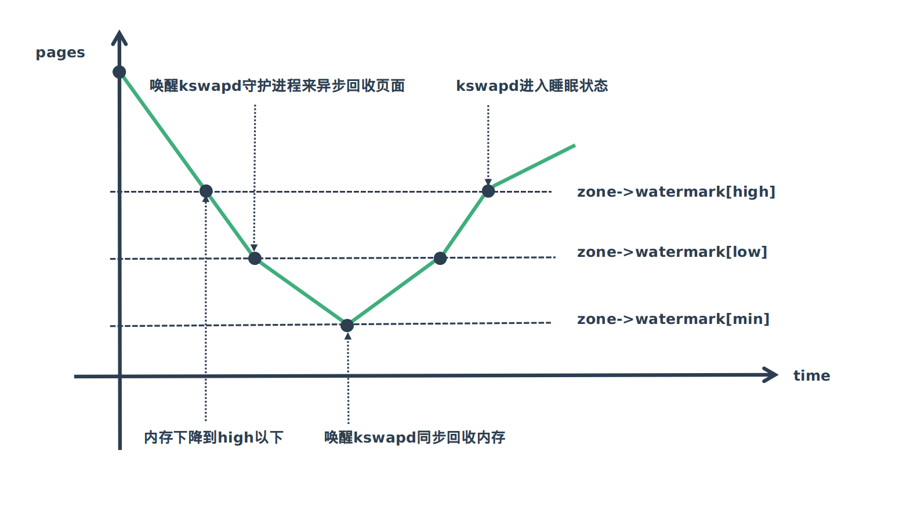
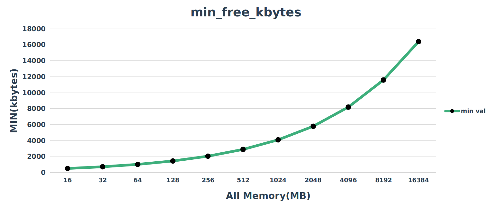

# 水位线的计算

水位线对于伙伴分配的过程比较重要，每次分配时都对水位线进行检测，所以水位线对系统内存管理非常重要，这里将详细介绍小位线在系统中是如何设定的，包括详细其详细的计算过程以及设定的思想。

## 1. 水位线的使用

水位线的会被用来指导内存的分配以及回收，具体如下图所示：



- 开始的时候内存处于非常充足的位置
- 再后一个节点，内存不断分配，剩余内存降到high以下
- 再后一个节点，内存降到low以下，这时系统感知内存不中会启动kswapd来异步回收内存
- 再后一个节点，内存降到min，这时基本不再分配内存，只有一些特殊的内存分配可以成功，kswapd会同步回收内存
- 随着内存不断回收，剩余内存又会回到high,这里kswapd工作完成进入休眠

## 2. 水位线的设置

水位线设置的代码如下：

```c {.line-numbers}

int __meminit init_per_zone_wmark_min(void)
{
	unsigned long lowmem_kbytes;
	int new_min_free_kbytes;

	lowmem_kbytes = nr_free_buffer_pages() * (PAGE_SIZE >> 10);
	new_min_free_kbytes = int_sqrt(lowmem_kbytes * 16);

	if (new_min_free_kbytes > user_min_free_kbytes) {
		min_free_kbytes = new_min_free_kbytes;
		if (min_free_kbytes < 128)
			min_free_kbytes = 128;
		if (min_free_kbytes > 262144)
			min_free_kbytes = 262144;
	} else {
		pr_warn("min_free_kbytes is not updated to %d because user defined value %d is preferred\n",
				new_min_free_kbytes, user_min_free_kbytes);
	}
	setup_per_zone_wmarks();
	refresh_zone_stat_thresholds();
	setup_per_zone_lowmem_reserve();

#ifdef CONFIG_NUMA
	setup_min_unmapped_ratio();
	setup_min_slab_ratio();
#endif

	khugepaged_min_free_kbytes_update();

	return 0;
}
postcore_initcall(init_per_zone_wmark_min)

```

从`postcore_initcall`可以知道调用流程是`start_kernel->rset_init->init_per_zone_wmark_min`,下面具体分析。

- 代码6～7行：
这里的lowmem_kbytes，不要被变量名迷惑，这个值其实是系统总内存使用KB计量。
看一下`nr_free_buffer_pages`就明白了

```c {.line-numbers}

unsigned long nr_free_buffer_pages(void)
{
	return nr_free_zone_pages(gfp_zone(GFP_USER));
}

static unsigned long nr_free_zone_pages(int offset)
{
	struct zoneref *z;
	struct zone *zone;

	/* Just pick one node, since fallback list is circular */
	unsigned long sum = 0;

	struct zonelist *zonelist = node_zonelist(numa_node_id(), GFP_KERNEL);

	for_each_zone_zonelist(zone, z, zonelist, offset) {
		unsigned long size = zone_managed_pages(zone);
		unsigned long high = high_wmark_pages(zone);
		if (size > high)
			sum += size - high;
	}

	return sum;
}

#define high_wmark_pages(z) (z->_watermark[WMARK_HIGH] + z->watermark_boost)


```
在初始化的时候上面的代码，计算出来的high其实是0,这个水位还没有设置，都是默认0.而且会遍历所有的zone,把各个zone管理的页面都加起来，所以`lowmem_kbytes`其实就是系统总内存量，就是总的页数×4。
第7行`new_min_free_kbytes`，计算公式如下

$$
new\_min\_free\_kbytes = \sqrt{lowmem_kbytes * 16}
$$

说明一下这个公式的设计思想，代码作者认为，随着系统内存总量的增加，那个应该保留的最低内存也应该增加，但不应该随着内存增加而线性的增加，原因是网络带宽的增加不是线性的，这个我认为是机器的负载不是线性的增加，更加直观如下图所示：




- 代码10行：
这里就是保存最小值到`min_free_kbytes`，下一步的计算会使用到这个值。

- 代码19行：
`setup_per_zone_wmarks()`开始计算`zone->_watermark[WMARK_MIN] ,zone->_watermark[WMARK_LOW], zone->_watermark[WMARK_HIGH]`的值。具体代码如下：

```c {.line-numbers}
void setup_per_zone_wmarks(void)
{
	static DEFINE_SPINLOCK(lock);

	spin_lock(&lock);
	__setup_per_zone_wmarks();
	spin_unlock(&lock);
}

static void __setup_per_zone_wmarks(void)
{
	unsigned long pages_min = min_free_kbytes >> (PAGE_SHIFT - 10);
	unsigned long lowmem_pages = 0;
	struct zone *zone;
	unsigned long flags;

	/* Calculate total number of !ZONE_HIGHMEM pages */
	for_each_zone(zone) {
		if (!is_highmem(zone))
			lowmem_pages += zone_managed_pages(zone);
	}

	for_each_zone(zone) {
		u64 tmp;

		spin_lock_irqsave(&zone->lock, flags);
		tmp = (u64)pages_min * zone_managed_pages(zone);
		do_div(tmp, lowmem_pages);
		if (is_highmem(zone)) {
			/*
			 * __GFP_HIGH and PF_MEMALLOC allocations usually don't
			 * need highmem pages, so cap pages_min to a small
			 * value here.
			 *
			 * The WMARK_HIGH-WMARK_LOW and (WMARK_LOW-WMARK_MIN)
			 * deltas control async page reclaim, and so should
			 * not be capped for highmem.
			 */
			unsigned long min_pages;

			min_pages = zone_managed_pages(zone) / 1024;
			min_pages = clamp(min_pages, SWAP_CLUSTER_MAX, 128UL);
			zone->_watermark[WMARK_MIN] = min_pages;
		} else {
			/*
			 * If it's a lowmem zone, reserve a number of pages
			 * proportionate to the zone's size.
			 */
			zone->_watermark[WMARK_MIN] = tmp;
		}

		/*
		 * Set the kswapd watermarks distance according to the
		 * scale factor in proportion to available memory, but
		 * ensure a minimum size on small systems.
		 */
		tmp = max_t(u64, tmp >> 2,
			    mult_frac(zone_managed_pages(zone),
				      watermark_scale_factor, 10000));

		zone->watermark_boost = 0;
		zone->_watermark[WMARK_LOW]  = min_wmark_pages(zone) + tmp;
		zone->_watermark[WMARK_HIGH] = min_wmark_pages(zone) + tmp * 2;

		spin_unlock_irqrestore(&zone->lock, flags);
	}

	/* update totalreserve_pages */
	calculate_totalreserve_pages();
}


```

代码逻辑其实非常简单，下面说明一下
- 代码18～21行：
  累加各个zone的页面数到`lowmem_pages`.
- 代码23行：
  就是对各个zone都计算一下水位线。
- 代码27～28行：
  这两个是整个函数的核心，这里的`pages_min`就是`min_free_kbytes`除以4转化为整个系统应该保留的最小页面数。那这里的`tmp`计算出来就应该是当前循环的zone所应保留的最小页面数，具体公式如下

  $$tmp = \frac{pages\_min * zone\_managed\_pages(zone)}{lowmem_pages} $$

  $$ = \frac{整个系统保留最少页面数 * 当前zone的页面数}{所有zone总的页面数}$$

  $$ = 整个系统保留最少页面数 * \frac{当前zone的页面数}{当前zone的页面数}$$

- 代码49行：
  设置`zone->_watermark[WMARK_MIN]`值

- 代码57～59：	
  这里就是从$\frac{tmp}{4}$和$当前zone页面数*\frac{10}{10000}$中取一个最大的，这里我的理解是考虑kswapd运行需要的最小内存，而且我的实验平台，最终都是$tmp=\frac{tmp}{4}$;

- 代码62~63行：
  设置`zone->_watermark[WMARK_LOW]`和`zone->_watermark[WMAR]`

## 3. 小结

  `zone->_watermark[WMARK_MIN]`是通过一个平方的公式计算出来的，而`zone->_watermark[WMARK_LOW]`是等于`zone->_watermark[WMARK_MIN]`的1.25倍，`zone->_watermark[WMARK_HIGH]`是`zone->_watermark[WMARK_MIN]`的1.5倍。

---
::: tip  

转载请注明出处！ [探索者](http://www.tsz.wiki)

:::

---
<Vssue :title="$title"/>
