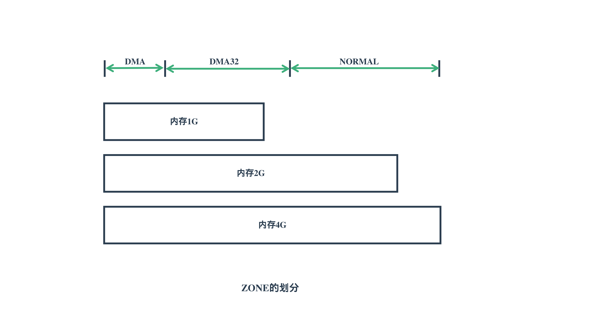
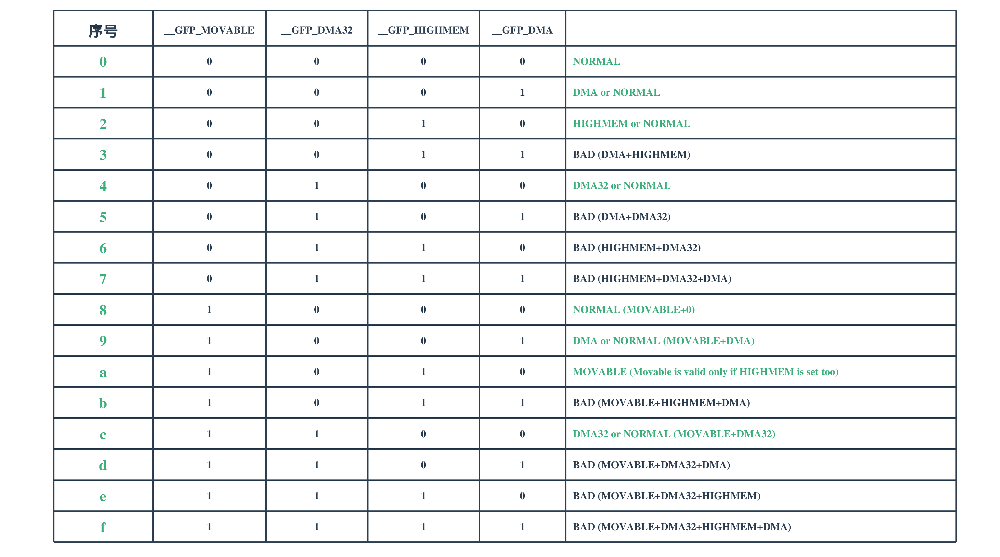

# ZOME的划分与选取

---

| 软件版本     | 硬件版本 | 更新内容 |
|--------------|----------|----------|
| linux 5.8.18 | arm64    |          |

---

本文主要介绍一下，在分内存页面时，ZONE的选择问题。

## 1. ZONE的划分

在内核ZONE的划分其实和内存本身的大小等并无关系，而是与不同的硬件平台有关系，每个硬件平台，每个ZONE的大小的固定的。



如图所示，DMA，DMA32，NORMAL分区都是预先定义的好，变化的是内存条的大小，无论内存是1G还是4G，DMA分区的大小都是一样的，例如在x86平台固定为16MB。也就是说切割的模具是固定的，无论被切割的材料是有多大，切割出来的`DMA`,`DMA32`都是固定的，剩下的都是属于`NORMAL`。

### 1.1 x86平台划分
```c
/* 16MB ISA DMA zone */
#define MAX_DMA_PFN   ((16UL * 1024 * 1024) >> PAGE_SHIFT)

/* 4GB broken PCI/AGP hardware bus master zone */
#define MAX_DMA32_PFN (1UL << (32 - PAGE_SHIFT))

void __init zone_sizes_init(void)
{
	unsigned long max_zone_pfns[MAX_NR_ZONES];

	memset(max_zone_pfns, 0, sizeof(max_zone_pfns));

#ifdef CONFIG_ZONE_DMA
	max_zone_pfns[ZONE_DMA]		= min(MAX_DMA_PFN, max_low_pfn);
#endif
#ifdef CONFIG_ZONE_DMA32
	max_zone_pfns[ZONE_DMA32]	= min(MAX_DMA32_PFN, max_low_pfn);
#endif
	max_zone_pfns[ZONE_NORMAL]	= max_low_pfn;
#ifdef CONFIG_HIGHMEM
	max_zone_pfns[ZONE_HIGHMEM]	= max_pfn;
#endif

	free_area_init(max_zone_pfns);
}

```
在x86_64平台下，这里的`max_low_pfn`基本是随着内存的大小而变化的，而且在64位已经不存在高端内存概念，因为地址空间已经足够的大了，所以这里的`max_low_pfn`等于`max_pfn`,从上面的代码可以看出来，无论内存有多大，`ZONE_DMA`最大只占16MB，当内存小于16MB，那所有的内存都属于`ZONE_DMA`。

### 1.2 arm64平台划分
```c
static void __init zone_sizes_init(unsigned long min, unsigned long max)
{
	unsigned long max_zone_pfns[MAX_NR_ZONES]  = {0};

#ifdef CONFIG_ZONE_DMA
	max_zone_pfns[ZONE_DMA] = PFN_DOWN(arm64_dma_phys_limit);
#endif
#ifdef CONFIG_ZONE_DMA32
	max_zone_pfns[ZONE_DMA32] = PFN_DOWN(arm64_dma32_phys_limit);
#endif
	max_zone_pfns[ZONE_NORMAL] = max;

	free_area_init(max_zone_pfns);
}
```
这里

$$
    arm64\_dma\_phys\_limit = 2147483648
$$
$$
    arm64\_dma32\_phys\_limit = 4294967296
$$
也就是说在arm64下，`DMA`分区固定为2G ，`DMA32`分区固定为4G。


## 2. ZONE的选择
前面我们介绍了ZOME的划分，这里我们介绍一下，在内存页分配时`ZOME`的选择问题。

::: tip ZONE选择的基本原则

内核总是希望以最廉价的资源来满足需求，所以应该优先从最廉价且能满足需求的`ZOME`来分配，只有在最廉价`ZOME`内存不足时，才从次廉价的内存中分配,依次类推直到分配完成。所以应该按
MOVABLE=>HIGHMEM=>NORMAL=>DMA32=>DMA
来分配，只有在 MOVABLE 不能满足需求时，才会选择 HIGHMEM，当然 gfp_mask 会决定从那个区开始依次遍历，直到找到一个区能满足需求。

:::

下面是代码分析

```c


/*
 * 这里是分配的核心函数，gfp_mask为分配掩码, preferred_nid为NUMA节点ID，order
 * 为分配的页面数
 */
struct page *
__alloc_pages_nodemask(gfp_t gfp_mask, unsigned int order, int preferred_nid,
							nodemask_t *nodemask)
{
	...

	/*
	 * prepare_alloc_pages 主要是初始化ac，具体见函数实现
	 * 这里有一个重要的操作就是选定 highest_zoneidx 和 zonelist
	 */
	if (!prepare_alloc_pages(gfp_mask, order, preferred_nid, nodemask, &ac, &alloc_mask, &alloc_flags))
	return NULL;

	...
}


static inline bool prepare_alloc_pages(gfp_t gfp_mask, unsigned int order,
		int preferred_nid, nodemask_t *nodemask,
		struct alloc_context *ac, gfp_t *alloc_mask,
		unsigned int *alloc_flags)
{
	...			
	/*
	 * 这里的 highest_zoneidx 决定了能满足需求的最廉价的内存ZPME
	 * zonelist,表示在最廉价内存不足时，依次遍历次廉价内存进行分配
	 */
	ac->highest_zoneidx = gfp_zone(gfp_mask);
	ac->zonelist = node_zonelist(preferred_nid, gfp_mask);
	...			
}

static inline enum zone_type gfp_zone(gfp_t flags)
{
	enum zone_type z;
	int bit = (__force int) (flags & GFP_ZONEMASK);

	z = (GFP_ZONE_TABLE >> (bit * GFP_ZONES_SHIFT)) &
					 ((1 << GFP_ZONES_SHIFT) - 1);
	VM_BUG_ON((GFP_ZONE_BAD >> bit) & 1);
	return z;
}

```
这里重点分析`gfp_zone()`,`GFP_ZONEMASK`为

```c
#define GFP_ZONEMASK	(__GFP_DMA|__GFP_HIGHMEM|__GFP_DMA32|__GFP_MOVABLE)

```
也就是在整个分配`flags`中表示分配区域的BIT位，就是最后4个BIT。
紧接着
```c

	z = (GFP_ZONE_TABLE >> (bit * GFP_ZONES_SHIFT)) &
					 ((1 << GFP_ZONES_SHIFT) - 1);
	VM_BUG_ON((GFP_ZONE_BAD >> bit) & 1);
```

其中`GFP_ZONES_SHIFT = 2`,这个比较好理解$2^{0|1|2|3} = 1|2|4|8$ 

```c
#if MAX_NR_ZONES < 2
#define ZONES_SHIFT 0
#elif MAX_NR_ZONES <= 2
#define ZONES_SHIFT 1
#elif MAX_NR_ZONES <= 4
#define ZONES_SHIFT 2
#elif MAX_NR_ZONES <= 8
#define ZONES_SHIFT 3

#define GFP_ZONES_SHIFT ZONES_SHIFT
```

其中`GFP_ZONE_TABLE`和`GFP_ZONE_BAD`为：
```c

// GFP_ZONES_SHIFT = 2
#define GFP_ZONE_TABLE ( \
	(ZONE_NORMAL << 0 * GFP_ZONES_SHIFT)				       \
	| (OPT_ZONE_DMA << ___GFP_DMA * GFP_ZONES_SHIFT)		       \
	| (OPT_ZONE_HIGHMEM << ___GFP_HIGHMEM * GFP_ZONES_SHIFT)	       \
	| (OPT_ZONE_DMA32 << ___GFP_DMA32 * GFP_ZONES_SHIFT)		       \
	| (ZONE_NORMAL << ___GFP_MOVABLE * GFP_ZONES_SHIFT)		       \
	| (OPT_ZONE_DMA << (___GFP_MOVABLE | ___GFP_DMA) * GFP_ZONES_SHIFT)    \
	| (ZONE_MOVABLE << (___GFP_MOVABLE | ___GFP_HIGHMEM) * GFP_ZONES_SHIFT)\
	| (OPT_ZONE_DMA32 << (___GFP_MOVABLE | ___GFP_DMA32) * GFP_ZONES_SHIFT)\
)

#define GFP_ZONE_BAD ( \
	1 << (___GFP_DMA | ___GFP_HIGHMEM)				      \
	| 1 << (___GFP_DMA | ___GFP_DMA32)				      \
	| 1 << (___GFP_DMA32 | ___GFP_HIGHMEM)				      \
	| 1 << (___GFP_DMA | ___GFP_DMA32 | ___GFP_HIGHMEM)		      \
	| 1 << (___GFP_MOVABLE | ___GFP_HIGHMEM | ___GFP_DMA)		      \
	| 1 << (___GFP_MOVABLE | ___GFP_DMA32 | ___GFP_DMA)		      \
	| 1 << (___GFP_MOVABLE | ___GFP_DMA32 | ___GFP_HIGHMEM)		      \
	| 1 << (___GFP_MOVABLE | ___GFP_DMA32 | ___GFP_DMA | ___GFP_HIGHMEM)  \
)

```

这里说明这两个宏的含义，看下图：



    1.NORMAL分区是只要被分配区域可以和其它的任何区搭配
    2.__GFP_DMA|__GFP_HIGHMEM|__GFP_DMA32 这3个BIT只能有一个BIT为1,原因很简单，最廉价的只能有一个
    3.___GFP_MOVABLE不仅仅是一个分配区域同时也是一种分配策略，所以可以搭配其他任何区 


## 3. ZNOE的遍历和页面分配

```c
get_page_from_freelist(gfp_t gfp_mask, unsigned int order, int alloc_flags,
						const struct alloc_context *ac)
{
	for_next_zone_zonelist_nodemask(zone, z, ac->zonelist,
					ac->highest_zoneidx, ac->nodemask) {

```

这个很理解就是从`highest_zoneidx`开始，遍历`zonelist`进行分配

---
::: tip 提示 

欢迎评论、探讨,如果发现错误请指正。转载请注明出处！ [探索者](http://www.tsz.wiki) 

:::


---
<Vssue :title="$title"/>
