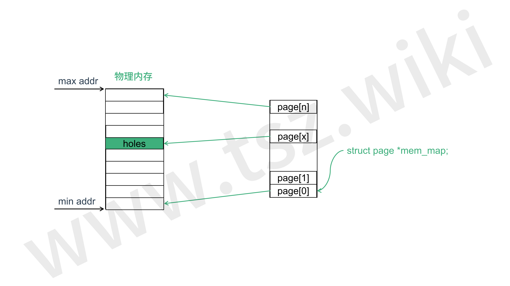
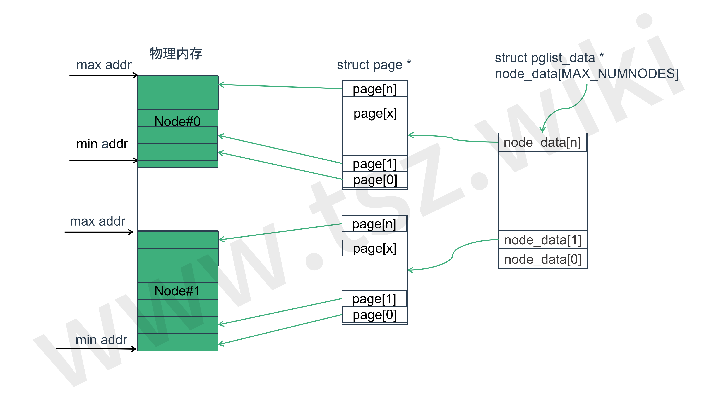
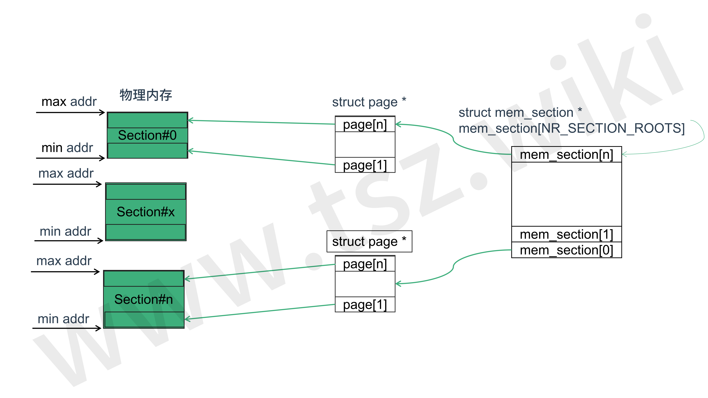

# 内存模型

---

| 软件版本  | 硬件版本 | 更新内容 |
|---------|--------|----------|
|linux 4.14| arm64   | first|

---
## 0 概述
系统中的物理内存可以用不同的方式处理。最简单的情况是，物理内存从地址0开始，跨越一个连续的范围，直到最大地址。但是，这个范围可能包含CPU无法访问的holes。然后在完全不同的地址上可能有几个相邻的范围。在NUMA，不同的cpu访问不同的内存。

Linux 中对物理内存存在三种模式 :FLATMEM、DISCONTIGMEM和SPARSEMEM。每个体系结构都定义了它支持什么内存模型、默认内存模型是什么以及是否可以手动覆盖该默认值。在arm64中只支持SPARSEMEM，本文的重点也在SPARSEMEM上。
## 1 FLATMEM 模型
FLATMEM 模型是最简单的模型。此模型适用于具有连续物理内存(或大部分为连续物理内存)的非numa系统。


在FLATMEM内存模型中，有一个全局mem_map数组，它映射整个物理内存。在mem_map数组中有些条目对应物理内存上holes,与这些holes对应的struct page 结构体没有完全初始化。


## 2 DISCONTIGMEM 模型
DISCONTIGMEM模型将物理内存视为节点集合，这与Linux NUMA支持的方式类似。对于每个节点，Linux都构造一个独立的内存管理子系统，由struct pglist_data(或简称pg_data_t)表示。pg_data_t包含node_mem_map数组，它映射属于该节点的物理页面。pg_data_t的node_start_pfn字段是属于该节点的第一个页面帧的编号。

每个node_mem_map数组其实就是一个FLATMEM内存模型。

::: tip DISCONTIGMEM

DISCONTIGMEM 使用情况很少，很快可能被废弃。

:::


## 3 SPARSEMEM 模型

SPARSEMEM是Linux中可用的最通用的内存模型，它是惟一支持多个高级特性的内存模型，比如物理内存的热插拔和热删除、非易失性内存设备的替代内存映射以及大型系统内存映射的延迟初始化。


SPARSEMEM模型将物理内存表示为section的集合。section由struct mem_section表示，其中包含section_mem_map，从逻辑上讲，它是指向struct页面数组的指针。使用SECTION_SIZE_BITS和MAX_PHYSMEM_BITS常量指定节的大小和最大节数，这些常量由支持SPARSEMEM的每个体系结构定义。MAX_PHYSMEM_BITS是体系结构支持的物理地址的实际宽度，SECTION_SIZE_BITS是一个任意值。


## 4 ARM64 内存模型

在 `mm/Kconfig` 中有如下配置项目

```
config SELECT_MEMORY_MODEL
	def_bool y
	depends on ARCH_SELECT_MEMORY_MODEL

choice
	prompt "Memory model"
	depends on SELECT_MEMORY_MODEL
	default DISCONTIGMEM_MANUAL if ARCH_DISCONTIGMEM_DEFAULT
	default SPARSEMEM_MANUAL if ARCH_SPARSEMEM_DEFAULT
	default FLATMEM_MANUAL

config FLATMEM_MANUAL
	bool "Flat Memory"
	depends on !(ARCH_DISCONTIGMEM_ENABLE || ARCH_SPARSEMEM_ENABLE) || ARCH_FLATMEM_ENABLE
	help
	  This option allows you to change some of the ways that
	  Linux manages its memory internally.  Most users will
	  only have one option here: FLATMEM.  This is normal
	  and a correct option.

	  Some users of more advanced features like NUMA and
	  memory hotplug may have different options here.
	  DISCONTIGMEM is a more mature, better tested system,
	  but is incompatible with memory hotplug and may suffer
	  decreased performance over SPARSEMEM.  If unsure between
	  "Sparse Memory" and "Discontiguous Memory", choose
	  "Discontiguous Memory".

	  If unsure, choose this option (Flat Memory) over any other.

config DISCONTIGMEM_MANUAL
	bool "Discontiguous Memory"
	depends on ARCH_DISCONTIGMEM_ENABLE
	help
	  This option provides enhanced support for discontiguous
	  memory systems, over FLATMEM.  These systems have holes
	  in their physical address spaces, and this option provides
	  more efficient handling of these holes.  However, the vast
	  majority of hardware has quite flat address spaces, and
	  can have degraded performance from the extra overhead that
	  this option imposes.

	  Many NUMA configurations will have this as the only option.

	  If unsure, choose "Flat Memory" over this option.

config SPARSEMEM_MANUAL
	bool "Sparse Memory"
	depends on ARCH_SPARSEMEM_ENABLE
	help
	  This will be the only option for some systems, including
	  memory hotplug systems.  This is normal.

	  For many other systems, this will be an alternative to
	  "Discontiguous Memory".  This option provides some potential
	  performance benefits, along with decreased code complexity,
	  but it is newer, and more experimental.

	  If unsure, choose "Discontiguous Memory" or "Flat Memory"
	  over this option.

endchoice

```
而在 `arch/arm64/Kconfig` 只有如下配置

```
config ARCH_SPARSEMEM_ENABLE
	def_bool y
	select SPARSEMEM_VMEMMAP_ENABLE

```
这样的话当你 `make menuconfig` 你只会看到只有 `Sparse Memory` 一个选项。也就是说在arm64位平台下只支持 SPARSEMEM_MANUAL

---
::: tip  

转载请注明出处！ [探索者](http://www.cxy.wiki)

:::


<Vssue :title="$title" />
