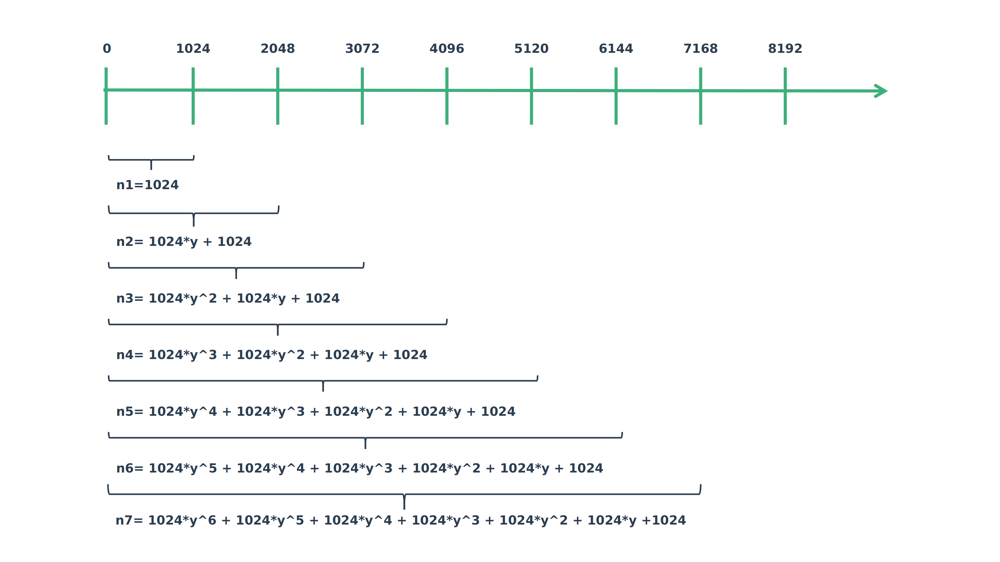
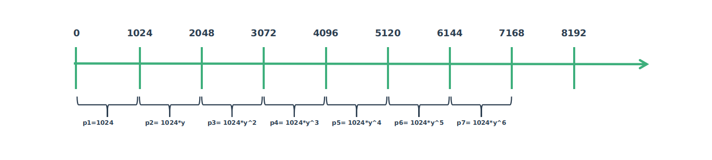
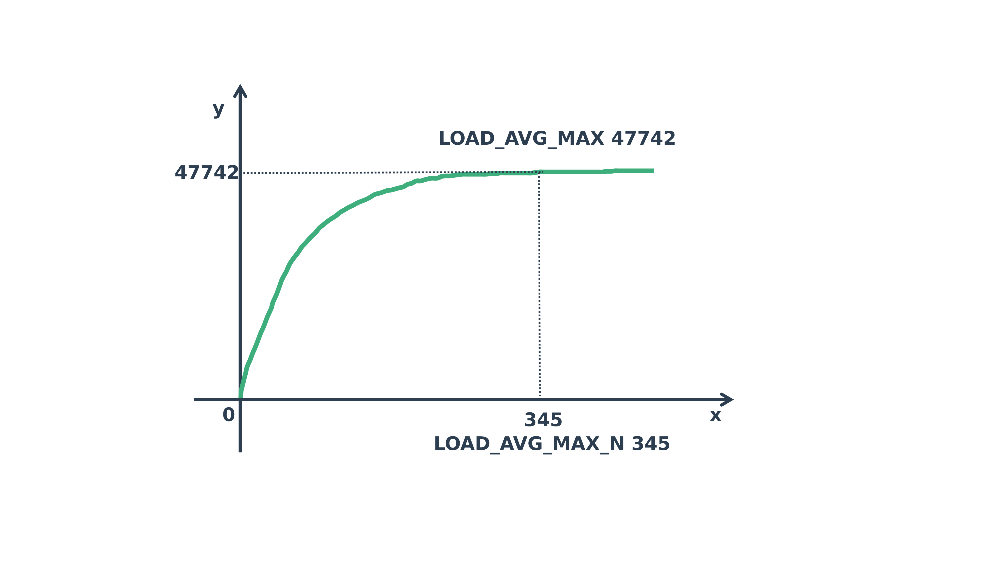
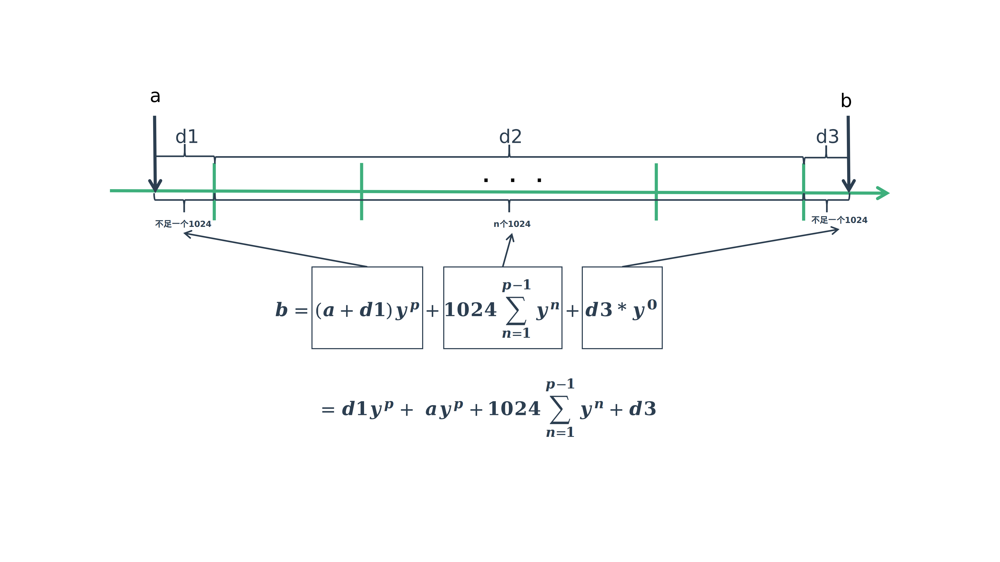

# PELT计算

---

| 软件版本  | 硬件版本 | 更新内容 |
|---------|--------|----------|
|linux 5.8.18| arm64   |        |

---

## 1. PELT概述

PELT是一种进程负载计算方法，它是在3.8之后的内核中引入的。在3.8之前的内核，如果计算一个进程的负载应该怎么计算，那么可能是通过进程的权重信息来计算的（具体我也没有看过），但是在系统中进程可能是多种多样的，有的是CPU密集性的，有的是IO密集性的，如果只考虑权重就显得不合理，尤其是在负载均衡的调度中就更加不合理了。

PELT是一种通过进程的历史信息来计算它的负载贡献，从而也反映它对CPU或者算力的真实需求，从而让调度器可以更好的调度其运行。


## 2. PELT计算

### 2.1 算法基本思想

- 将进程运行时间分为一个个计算周期，内核中以1024us为一个周期
- 在第n个周期的负载贡献经过m个周期会衰减成$P_m = P_n * y^m$，内核中定义了一个衰减因子y=0.97857206
- 每周过32个周期负载贡献会衰减为原来的一半,也就是$y^32=0.5$

如下图所示：

 通过上图，我们可以发现这里其实是一个等比数列求和的过程。我们可以把上图转化成下面这个图：

也就是说：$n_7 = p_7+p_6+p_5+p_4+p_3+p_2+p_1$，另外还可以得到通项公式：$p_n=p_1*y^{n-1}$
这里我们直接给出等比数列求和公式，推导过程请自己google一下就可以了，公式如下：
$$S_n=np_1,(y=1)$$
$$S_n=\frac{p_1*(1-y^n)}{1-y}=\frac{p_1-p_ny}{1-y} = \frac{p_ny-p_1}{y-1},(y\ne1)$$
那么这里 y=0.97857206, 内核中取了一个n=LOAD_AVG_MAX_N=345,这样就得到
$$S_{max}=47742$$

为什么可以这样取值，可以看下面的这个等比数列求和曲线：


### 2.2 计算过程

计算过程分为下面三个阶段，分别为d1,d2,d3，如下图所示：


说明：
- a点为上次计算的时间点，b点为当前计算点
- 从a到b一共经过了p个周期
- d1部分会单计算$d1*y^p$
- d3部分不需要计算因为$d3*y0=d3$
- d2部分就是我们前面2.1中等比数列求和，只是内核做一些优化，回头代码中再看

代码分析：
```c
static void task_tick_fair(struct rq *rq, struct task_struct *curr, int queued)
{
    ...
	entity_tick(cfs_rq, se, queued);
    ...
}

entity_tick(struct cfs_rq *cfs_rq, struct sched_entity *curr, int queued)
{
    ...
	 * 这里主要是PELT(per entity load tracking)的部分，这块相对比较复杂
	 *
	 * PELT的主要思想就是通过对历史数据的统计得到当前进程对系统负载的贡献
	 * 从而指导未来的调度包括负载均衡。
	 *
	 */
	update_load_avg(cfs_rq, curr, UPDATE_TG);
    ...
}

static inline void update_load_avg(struct cfs_rq *cfs_rq, struct sched_entity *se, int flags)
{
	u64 now = cfs_rq_clock_pelt(cfs_rq);
	int decayed;

	/*
	 * Track task load average for carrying it to new CPU after migrated, and
	 * track group sched_entity load average for task_h_load calc in migration
	 */
	/*
	 * 计算PELT部分
	 */
	if (se->avg.last_update_time && !(flags & SKIP_AGE_LOAD))
		__update_load_avg_se(now, cfs_rq, se);
    ...
}

int __update_load_avg_se(u64 now, struct cfs_rq *cfs_rq, struct sched_entity *se)
{
	/*
	 * ___update_load_sum是求和的过程
	 * ___update_load_avg是求平均值的过程
	 *
	 */
	if (___update_load_sum(now, &se->avg, !!se->on_rq, se_runnable(se),
				cfs_rq->curr == se)) {

		___update_load_avg(&se->avg, se_weight(se));
		cfs_se_util_change(&se->avg);
		trace_pelt_se_tp(se);
		return 1;
	}

	return 0;
}

static __always_inline int
___update_load_sum(u64 now, struct sched_avg *sa,
		  unsigned long load, unsigned long runnable, int running)
{
	u64 delta;
	/*
	 * 计算delta值
	 */

	delta = now - sa->last_update_time;
	/*
	 * This should only happen when time goes backwards, which it
	 * unfortunately does during sched clock init when we swap over to TSC.
	 */
	if ((s64)delta < 0) {
		sa->last_update_time = now;
		return 0;
	}

	/*
	 * Use 1024ns as the unit of measurement since it's a reasonable
	 * approximation of 1us and fast to compute.
	 */
	delta >>= 10;
	if (!delta)
		return 0;

	sa->last_update_time += delta << 10;

	/*
	 * running is a subset of runnable (weight) so running can't be set if
	 * runnable is clear. But there are some corner cases where the current
	 * se has been already dequeued but cfs_rq->curr still points to it.
	 * This means that weight will be 0 but not running for a sched_entity
	 * but also for a cfs_rq if the latter becomes idle. As an example,
	 * this happens during idle_balance() which calls
	 * update_blocked_averages().
	 *
	 * Also see the comment in accumulate_sum().
	 */
	if (!load)
		runnable = running = 0;

	/*
	 * Now we know we crossed measurement unit boundaries. The *_avg
	 * accrues by two steps:
	 *
	 * Step 1: accumulate *_sum since last_update_time. If we haven't
	 * crossed period boundaries, finish.
	 */
	/*
	 * 真正的计算过程
	 */
	if (!accumulate_sum(delta, sa, load, runnable, running))
		return 0;

	return 1;
}
static __always_inline u32
accumulate_sum(u64 delta, struct sched_avg *sa,
	       unsigned long load, unsigned long runnable, int running)
{
	u32 contrib = (u32)delta; /* p == 0 -> delta < 1024 */
	u64 periods;
	/*
	 * 这里加上这个值就可以将d1部分补成一个完整的1024
	 * periods = delta / 1024
	 */
	delta += sa->period_contrib;
	periods = delta / 1024; /* A period is 1024us (~1ms) */

	/*
	 * Step 1: decay old *_sum if we crossed period boundaries.
	 */
	/*
	 * 这里如果连一个完整周期都没有也就是说只有d3部分，那就不需要计算了
	 * 直接加上就行了。
	 *
	 */
	if (periods) {
		/*
		 * 第一步 ，计算u*y^p，也就是d1部分
		 * 其实就是老化上一次计算的结果
		 */
		sa->load_sum = decay_load(sa->load_sum, periods);
		sa->runnable_sum =
			decay_load(sa->runnable_sum, periods);
		sa->util_sum = decay_load((u64)(sa->util_sum), periods);

		/*
		 * Step 2
		 */
		delta %= 1024;
		if (load) {
			/*
			 * This relies on the:
			 *
			 * if (!load)
			 *	runnable = running = 0;
			 *
			 * clause from ___update_load_sum(); this results in
			 * the below usage of @contrib to dissapear entirely,
			 * so no point in calculating it.
			 */
			contrib = __accumulate_pelt_segments(periods,
					1024 - sa->period_contrib, delta);
		}
	}
	/*
	 * 这个其实存在值等于d3
	 */
	sa->period_contrib = delta;

	/*
	 * 设置相关的值
	 *
	 */

	if (load)
		sa->load_sum += load * contrib;
	if (runnable)
		sa->runnable_sum += runnable * contrib << SCHED_CAPACITY_SHIFT;
	if (running)
		sa->util_sum += contrib << SCHED_CAPACITY_SHIFT;

	return periods;
}

static u64 decay_load(u64 val, u64 n)
{
	unsigned int local_n;

	if (unlikely(n > LOAD_AVG_PERIOD * 63))
		return 0;

	/* after bounds checking we can collapse to 32-bit */
	local_n = n;

	/*
	 * As y^PERIOD = 1/2, we can combine
	 *    y^n = 1/2^(n/PERIOD) * y^(n%PERIOD)
	 * With a look-up table which covers y^n (n<PERIOD)
	 *
	 * To achieve constant time decay_load.
	 */
	/*
	 * 这里就是如果大于32
	 * 那么直接先除以 LOAD_AVG_PERIOD=32, 得到的值n,就是就是需要衰减的 1/2^n
	 */
	if (unlikely(local_n >= LOAD_AVG_PERIOD)) {
		val >>= local_n / LOAD_AVG_PERIOD;
		local_n %= LOAD_AVG_PERIOD;
	}

	/*
	 * runnable_avg_yN_inv这个数组存放的是 Vn = y^n * 2^32
	 * 就是为了避免做浮点运算
	 *
	 * 其实本质上还是val*y^n
	 *
	 */
	val = mul_u64_u32_shr(val, runnable_avg_yN_inv[local_n], 32);
	return val;
}
___update_load_avg(struct sched_avg *sa, unsigned long load)
{
	/*
	 * 这里的load的是指权重值
	 */
	u32 divider = LOAD_AVG_MAX - 1024 + sa->period_contrib;

	/*
	 * Step 2: update *_avg.
	 */
	sa->load_avg = div_u64(load * sa->load_sum, divider);
	sa->runnable_avg = div_u64(sa->runnable_sum, divider);
	WRITE_ONCE(sa->util_avg, sa->util_sum / divider);
}


```

## 3. 小结

这块的计算复杂是因为使用很多优化的计算方法，搞的不太好理解,当我们详细分析计算过程中还是比较容易的。

---
::: tip Tip 

欢迎评论、探讨,如果发现错误请指正。转载请注明出处！ [探索者](http://www.tsz.wiki) 

:::


---
<Vssue :title="$title"/>
