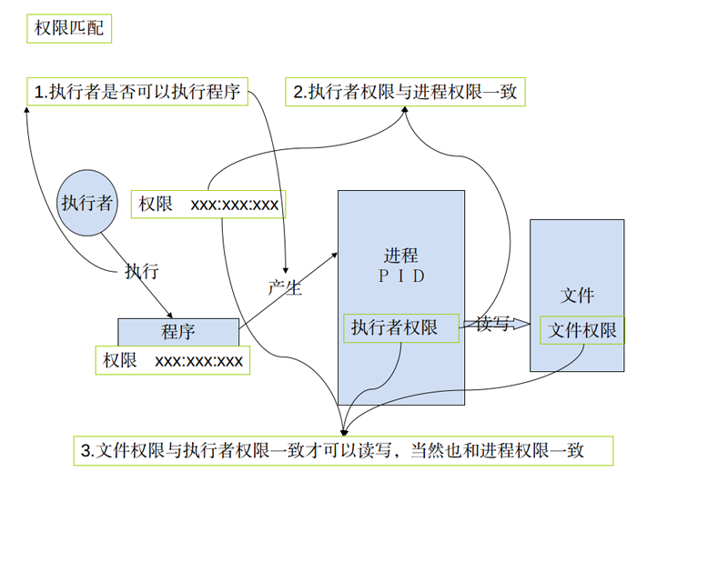
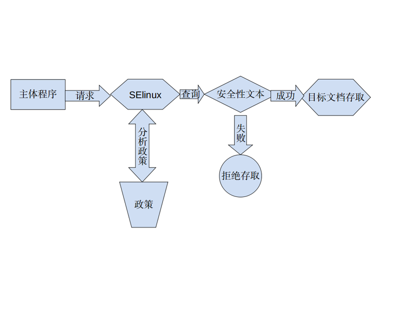

## 0.简介
 <br />
SELINUX是可以理解为一种android上面的安全机制，是有美国国家安全局和一些公司设计的一个针对linux的安全加强系统我们可以通过配置SELINUX的相关policy，来定制自己的手机的一些权限。它比原有linux 权限机制更加严格。<br />


## 1.现有权限介绍

现有的权限:自主式访问控制, DAC<br />
DAC 访问方式如下图所示：<br />

 
 上面的这个上关系可以通过以下方法来测试：
 
 

 1. 在一台linux机器建立两个普通账户。
 2. 用root 权限打开/tmp/目录，新建立目录，并打开。
 3. 用其中一个账户来编写如下的程序并通过ＧＣＣ编译
 4. 用同一个账户来touch t.txt
 5. 用同一个账户来执行编译出来的程序，发现可以正常执行
 6. 用另个一个账户来执行相同的程序，发现可以执行但不能读写文件

 
```c

#include ”stdio.h“

void main(void) {
	FILE *fp;
	char ch; 
	if ((fp = fopen("./t.txt","rt+")) == NULL) {
		printf("Cannot open file and Exit!");
		exit(1);
	}
	printf("input a string:\n");
	ch=getchar();
	while (ch != '*') {
		fputc(ch,fp);
		ch=getchar();
	}
	rewind(fp);
	ch = fgetc(fp);
	while (ch != EOF) {
		putchar(ch);
		ch = fgetc(fp);
	}					
	printf("The end and Close file!\n");
	fclose(fp);
	exit(0);
}

```
## 2. 现有权限存在的问题
<br />
 - root 具有最高的权限:如果不小心某支程序被有心人士取得, 且该程序属于 root的权限,那么这支程序就可以在系统上进行任何资源的存取!    
 <br />
 - 用户可以取得程序来变更档案资源的访问权限:如果你不小心将某个目录的权限设定为777,由于对任何人的权限会变成rwx,因此该目录就会被任何人所任意存取!

## 3.SElinux权限控制
 <br />
SElinux权限控制:委任式访问控制, MAC<br />
**他可以针对特定的程序与特定的档案资源来进行权限的控管! 也就是说,即使你是root,那么在使用不同的程序时,你所能取得的权限并不一定是 root ,而得要看当时该程序的设定而定。如此一来,我们针对控制的『主体』变成了『程序』而不是用户.此外,这个主体程序也不能任意使用系统档案资源,因为每个档案资源也有针对该主体程序设定可取用的权限.** <br />
如此一来,控件目就细的多了!但整个系统程序那么多、档案那么多,一项一项控制可就没完没了! 所以SELinux 也提供一些预设的政策 (Policy) ,并在该政策内提供多个规则(rule),让你可以选择是否启用该控制规则!

## 4.SELinux 的运作模式
 <br />
 
再次的重复说明一下,SELinux 是透过 MAC 的方式来控管程序,他控制的主体是程序, 而目标则是该
程序能否读取的『档案资源』!所以先来说明一下这些的相关性<br />
**主体 (Subject):**
SELinux 主要想要管理的就是程序,因此你可以将『主体』跟process 划上等号; <br />
**目标 (Object):**
主体程序能否存取的『目标资源』一般就是文件系统。因此这个目标项目可以等文件系统划上等
号;<br />
**政策 (Policy):**
由于程序与档案数量庞大,因此 SELinux 会依据某些服务来制订基本的存取安全性政策。这些政
策内还会有详细的规则 (rule) 来指定不同的服务开放某些资源的存取与否。<br />
**安全性本文 (security context):**
我们刚刚谈到了主体、目标与政策面,但是主体能不能存取目标除了政策指定之外,主体与目标
的安全性本文必须一致才能够顺利存取。 这个安全性本文 (security context) 有点类似文件系统
的 rwx 啦!安全性本文的内容与设定是非常重要的! 如果设定错误,你的某些服务(主体程序)就
无法存取文件系统(目标资源),当然就会一直出现『权限不符』的错误讯息了! <br />
安全性本文存在于主体程序中与目标档案资源中。程序在内存内,所以安全性本文可以存入是没问题。那档案的安全性本文是记录在哪里呢?事实上,安全性本文是放置到档案的 inode 内的,因此主体程序想要读取目标档案资源时,同样需要读取 inode , 这 inode 内就可以比对安全性本文以及 rwx 等权限值是否正确,而给予适当的读取权限依据。<br />
 先看系统中的安全性文本：<br />
 1.先看文件的安全性文本
```
shell@msm8226:/ # ls -Z
drwxr-xr-x root     root              u:object_r:cgroup:s0 acct
drwxrwx--- system   cache             u:object_r:cache_file:s0 cache
lrwxrwxrwx root     root              u:object_r:rootfs:s0 charger -> /sbin/healthd
dr-x------ root     root              u:object_r:rootfs:s0 config
lrwxrwxrwx root     root              u:object_r:rootfs:s0 d -> /sys/kernel/debug
drwxrwx--x system   system            u:object_r:system_data_file:s0 data
-rw-r--r-- root     root              u:object_r:rootfs:s0 default.prop
drwxr-xr-x root     root              u:object_r:device:s0 dev
lrwxrwxrwx root     root              u:object_r:rootfs:s0 etc -> /system/etc
-rw-r--r-- root     root              u:object_r:rootfs:s0 file_contexts
dr-xr-x--- system   system            u:object_r:firmware_file:s0 firmware
-rw-r----- root     root              u:object_r:rootfs:s0 fstab.qcom


```
2.再看一下进程的安全性文本：
```
u:r:init:s0                    root      1     0     /init
u:r:kernel:s0                  root      2     0     kthreadd
u:r:kernel:s0                  root      3     2     ksoftirqd/0
u:r:kernel:s0                  root      6     2     kworker/u:0
u:r:kernel:s0                  root      7     2     kworker/u:0H
u:r:kernel:s0                  root      8     2     migration/0
u:r:kernel:s0                  root      9     2     watchdog/0
u:r:kernel:s0                  root      25    2     khelper
u:r:kernel:s0                  root      26    2     netns
u:r:kernel:s0                  root      31    2     kworker/0:1H
u:r:kernel:s0                  root      32    2     modem_notifier
u:r:kernel:s0                  root      33    2     smd_channel_clo
u:r:kernel:s0                  root      34    2     smsm_cb_wq
u:r:kernel:s0                  root      36    2     rpm-smd
u:r:kernel:s0                  root      37    2     kworker/u:1H
u:r:kernel:s0                  root      44    2     irq/47-cpr
u:r:kernel:s0                  root      45    2     mpm

```
如上所示,安全性本文主要用冒号分为三个字段,这三个字段的意义为:<br />
**Identify:Role:Type[:Range]**
**身份识别:角色:类型**<br />
这三个字段的意义仔细的说明一下吧:<br />
**身份识别 (Identify):**
相当于账号方面的身份识别!主要的身份识别则有底下三种常见的类型:

 - root:表示 root 的账号身份,如同上面的表格显示的是 root 家目录下的数据啊! 
 - system_u:表示系统程序方面的识别,通常就是程序啰; 
 - user_u:代表的是一般使用者账号相关的身份。

你会发现身份识别中,除了 root 之外,其他的识别后面都会加上『 _u 』的字样呢! 这个身份识别重点再让我们了解该数据为何种身份所有哩~ 而系统上面大部分的数据都会是 system_u 或root 啦!至于如果是在 /home 底下的数据,那么大部分应该就会是 user_u .<br />
**角色 (Role):**
透过角色字段,我们可以知道这个数据是属于程序、档案资源还是代表使用者。一般的角色有:

 - object_r:代表的是档案或目录等档案资源,这应该是最常见的啰;
 - system_r:代表的就是程序啦!不过,一般使用者也会被指定成为 system_r 喔!
 
你也会发现角色的字段最后面使用『 _r 』来结尾!因为是 role 的意思嘛!<br />
**类型 (Type) :(最重要!)**
 基本上,一个主体程序能不能读取到这个档案资源,与类型字段有关!而类型字段
在档案与程序的定义不太相同,分别是:

 - type:在档案资源 (Object) 上面称为类型 (Type);
 - domain:在主体程序 (Subject) 则称为领域 (domain) 了!

domain 需要与 type 搭配,则该程序才能够顺利的读取档案资源啦!<br />
**级别(Range):**<br />
级别和SELinux为了满足军用和教育行业而设计的Multi-Level Security（MLS）机制有关。但是在Android中，因为只使用了S0所以这里不作更多的介绍。<br />
**之间的关系如下图所示：**<br />


## 5.SElinxu为什么可以解决DAC的问题？
<br />
 **先说一下，加入SElinux之后的访问是什么样的？**<br />
 加入SElinux之后，DAC的访问方式没有废弃，而是DAC和MAC 两者合作达成一个更加安全的访问控制。一般是先进行DAC的检查，然后再进行MAC的检查，两者都通过才可以访问。<br />
  **SElinux 是怎么解决DAC的安全问题的？**<br />
**DAC是基于用户的权限控制，也是说一个用户只要有读写这个文件的权限的，那么他就可以启动任何一个进程去读写这个文件，而MAC是基于域或者类型的访问控制，换句话说，它控制的对象不是用户，而是一个进程或者说是一个域（当然对于文件来说是类型），例如，以root启动一个程序, 如果是DAC 的时代，那这个上程序可以操作任何一个文件，但是MAC的时代，情况就一样了，就算是root要操作一个文件，也必需要符合相关政策 (Policy)的规定。所以说SElinux解决了ＤＡＣ的问题。**

## 6.Android中SElinux的体现


### 6.1 Android 中的安全性文本
<br />Android 中的安全性文本主要在这这个目录下：`external/sepolicy/`
 这这个目录下执行`ls *_contexts`可以看到：
 
```
file_contexts  genfs_contexts  initial_sid_contexts  port_contexts  property_contexts  seapp_contexts  service_contexts
```

这些文件都是Android 中的安全性文本。 <br />
**注意：**
进程的安全性文本在那存放？
进程的安全性文本一般会由.rc的文件指定，在程序启动时候作为进程信息一部分存在，这样我们在执行ps -Ｚ时才能看到。<br />
介绍一下各个文件的作用：

 - file_contexts：主要是文件相关的
 - seapp_contexts：主要是ＡＰＰ相关的
 - property_contexts：主要是系统属性相关的
 - initial_sid_contexts：主要是配合initial_sids（也在external/sepolicy）使用的，主要是用来初始化Object的安全性文本，在相关资料中这个动作称为Security Labeling
 - port_contexts：主要是网络相关的
 - service_contexts：主要系统服务相关的
 - genfs_contexts：主要是一些特殊的文件相关
<br />
**以file_contexts为例，内容如下(实在是太长了，以下是部分)：**
<br />可以对照安全性本文的介绍看一下。
<br />

```
###########################################
# Root
/			u:object_r:rootfs:s0

# Data files
/adb_keys		u:object_r:adb_keys_file:s0
/default\.prop		u:object_r:rootfs:s0
/fstab\..*		u:object_r:rootfs:s0
/init\..*		u:object_r:rootfs:s0
/res(/.*)?		u:object_r:rootfs:s0
/ueventd\..*		u:object_r:rootfs:s0

# Executables
/charger		u:object_r:rootfs:s0
/init			u:object_r:rootfs:s0
/sbin(/.*)?		u:object_r:rootfs:s0

# Empty directories
/lost\+found		u:object_r:rootfs:s0
/proc			u:object_r:rootfs:s0

# SELinux policy files
/file_contexts		u:object_r:rootfs:s0
/property_contexts	u:object_r:rootfs:s0
/seapp_contexts		u:object_r:rootfs:s0
/sepolicy		u:object_r:rootfs:s0

##########################
# Devices
#
/dev(/.*)?		u:object_r:device:s0
/dev/akm8973.*		u:object_r:sensors_device:s0
/dev/accelerometer	u:object_r:sensors_device:s0
/dev/adf[0-9]*		u:object_r:graphics_device:s0
......
/dev/tty		u:object_r:owntty_device:s0
/dev/tty[0-9]*		u:object_r:tty_device:s0
/dev/ttyS[0-9]*		u:object_r:serial_device:s0
/dev/tun		u:object_r:tun_device:s0
/dev/uhid		u:object_r:uhid_device:s0
/dev/uinput		u:object_r:uhid_device:s0
/dev/uio[0-9]*		u:object_r:uio_device:s0
/dev/urandom		u:object_r:urandom_device:s0
/dev/usb_accessory	u:object_r:usbaccessory_device:s0
#############################
# System files
#
/system(/.*)?		u:object_r:system_file:s0
/system/bin/sh		--	u:object_r:shell_exec:s0
/system/bin/run-as	--	u:object_r:runas_exec:s0
/system/bin/bootanimation u:object_r:bootanim_exec:s0
/system/bin/app_process32	u:object_r:zygote_exec:s0
/system/bin/app_process64	u:object_r:zygote_exec:s0
/system/bin/servicemanager	u:object_r:servicemanager_exec:s0
/system/bin/surfaceflinger	u:object_r:surfaceflinger_exec:s0
......
/system/bin/uncrypt     u:object_r:uncrypt_exec:s0
/system/bin/logwrapper  u:object_r:system_file:s0
/system/bin/vdc         u:object_r:vdc_exec:s0
/system/bin/install-recovery.sh u:object_r:install_recovery_exec:s0
/system/bin/dex2oat     u:object_r:dex2oat_exec:s0
# patchoat executable has (essentially) the same requirements as dex2oat.
/system/bin/patchoat    u:object_r:dex2oat_exec:s0

#############################
# Vendor files
#
/vendor(/.*)?		u:object_r:system_file:s0
/vendor/bin/gpsd	u:object_r:gpsd_exec:s0
#############################
# Data files
#
/data(/.*)?		u:object_r:system_data_file:s0
/data/.layout_version		u:object_r:install_data_file:s0
......
/data/mediadrm(/.*)?	u:object_r:media_data_file:s0
/data/property(/.*)?	u:object_r:property_data_file:s0

# Misc data
/data/misc/adb(/.*)?            u:object_r:adb_keys_file:s0
/data/misc/audio(/.*)?          u:object_r:audio_data_file:s0
/data/misc/bluetooth(/.*)?      u:object_r:bluetooth_data_file:s0
/data/misc/bluedroid(/.*)?      u:object_r:bluetooth_data_file:s0
/data/misc/bluedroid/\.a2dp_ctrl u:object_r:bluetooth_socket:s0
......
/data/misc/user(/.*)?           u:object_r:misc_user_data_file:s0
/data/misc/vpn(/.*)?            u:object_r:vpn_data_file:s0
/data/misc/wifi(/.*)?           u:object_r:wifi_data_file:s0
/data/misc/wifi/sockets(/.*)?   u:object_r:wpa_socket:s0
/data/misc/wifi/sockets/wpa_ctrl.*   u:object_r:system_wpa_socket:s0
/data/misc/wifi/hostapd(/.*)?   u:object_r:wpa_socket:s0
/data/misc/zoneinfo(/.*)?       u:object_r:zoneinfo_data_file:s0

# coredump directory for userdebug/eng devices
/cores(/.*)?                    u:object_r:coredump_file:s0

# Wallpaper file for other users
/data/system/users/[0-9]+/wallpaper		u:object_r:wallpaper_file:s0
#############################
# efs files
#
/efs(/.*)?		u:object_r:efs_file:s0
#############################
# Cache files
#
/cache(/.*)?		u:object_r:cache_file:s0
/cache/.*\.data	u:object_r:cache_backup_file:s0
/cache/.*\.restore	u:object_r:cache_backup_file:s0
# LocalTransport (backup) uses this directory
/cache/backup(/.*)?	u:object_r:cache_backup_file:s0
#############################
# sysfs files
#
/sys/devices/platform/nfc-power/nfc_power -- u:object_r:sysfs_nfc_power_writable:s0
/sys/devices/system/cpu(/.*)?    u:object_r:sysfs_devices_system_cpu:s0
/sys/power/wake_lock -- u:object_r:sysfs_wake_lock:s0
/sys/power/wake_unlock -- u:object_r:sysfs_wake_lock:s0
/sys/kernel/uevent_helper --	u:object_r:usermodehelper:s0
/sys/module/lowmemorykiller(/.*)? -- u:object_r:sysfs_lowmemorykiller:s0

#############################
# asec containers
/mnt/asec(/.*)?             u:object_r:asec_apk_file:s0
/mnt/asec/[^/]+/[^/]+\.zip  u:object_r:asec_public_file:s0
/mnt/asec/[^/]+/lib(/.*)?   u:object_r:asec_public_file:s0
/data/app-asec(/.*)?        u:object_r:asec_image_file:s0

```

### 6.2 Android 中的政策

MAC基本管理单位是TEAC（Type Enforcement Accesc Control）,体现ＴＥＡＣ的东西正好就是我们这里将要介绍的政策。<br />
**政策文件存在位置:**`external/sepolicy` 
在这里我们看到大量的.te文件，其实里面就是TEAC的各种配置。因为程序和文件实在是太多了，所以Android中配置都是基于域和类型来的。也就是在这些.te中你可能经常会看到像下的这句：
`
allow system_server i2c_device:chr_file { open read write ioctl};
`
上面的这句就是政策文件的一项配置，整个政策文件都是由这样的语句组成的。<br />
**这样的语句的语法格式是：**<br />
`rule_name source_type target_type : class perm_set`<br />
分开的介绍：

**rule_name:** 主要是allow,allowaudit,dontaudit,neverallow
 这里没什么好说就是一种动作，允许或者never允许，其他两个因为很少去用，也没具体查是什么意思<br />
**source_type:**指程序或者是程序所属的域（domain）
在相关的.te文件中定义，如system_server这个domain在`system_server.te`中定义：
```
system_server.te:5:type system_server, domain, mlstrustedsubject;
```
**target_type:**指文件或者文件的类型
在相关的.te文件中定义。<br />

> 关于类型定义一会再详细介绍一下。


<br />

**class：**`这个比较复杂，一会重点介绍`
**perm_set：**在该类Object Class中所定义的操作。
 
 
`class`这个地方不好理解,其实不知道应该怎么去解释它，可能需要和perm_set结合起来去理解会好一点。下面详细说一下：

1.cat `external/sepolicy/security_classes`可以看到如下信息：
```
# Classes marked as userspace are classes
# for userspace object managers

class security
class process
class system
class capability

# file-related classes
class filesystem
class file
class dir
class fd
class lnk_file
class chr_file
class blk_file
class sock_file
class fifo_file

# network-related classes
class socket
class tcp_socket
class udp_socket
class rawip_socket
class node
class netif
class netlink_socket
class packet_socket
class key_socket
class unix_stream_socket
class unix_dgram_socket

```
根据SELinux规范，Object Class类型由class关键字申明<br />
2.cat `external/sepolicy/access_vectors`可以看到如下信息：
```
#
# Define a common prefix for file access vectors.
#

common file
{
	ioctl
	read
	write
	create
	getattr
	setattr
	lock
	relabelfrom
	relabelto
	append
	unlink
	link
	rename
	execute
	swapon
	quotaon
	mounton
}


#
# Define a common prefix for socket access vectors.
#

common socket
{
# inherited from file
	ioctl
	read
	write
	create
	getattr
	setattr
	lock
	relabelfrom
	relabelto
	append
# socket-specific
	bind
	connect
	listen
	accept
	getopt
	setopt
	shutdown
	recvfrom
	sendto
	recv_msg
	send_msg
	name_bind
}


```
SELinux规范中，定义perm set有两种方式:

 1. common common_name { permission_name ... } 
 common定义的perm set能被另外一种perm set命令class所继承
 2. class class_name [ inherits common_name ] { permission_name ... }
 inherits表示继承了某个common定义的权限  注意，class命令定义的权限其实针对得就是某个object class。它不能被其他class继承
 
下面用例子说明一下：
```
common file {
      ioctl read write create getattr setattr lock relabelfrom relabelto
      append unlink link rename execute swapon quotaon mounton }
```
```
class dir inherits file {
   add_name  remove_name reparent search rmdir open audit_access execmod
}
```
 
### 6.3 类型定义
 类型定义通过type 来进行<br />
**type命令的完整格式为：**`type type_id [alias alias_id,] [attribute_id]`
其中，方括号中的内容为可选。alias指定了type的别名，可以指定多个别名。
下面这个例子定义了一个名为shell的type，它和一个名为domain的属性（attribute）关联 :
`type shell, domain;`

属性由`attribute`关键字定义，如attributes文件中定义的SEAndroid使用的属性有：
```
attribute domain
attribute file_type
``` 
可以在定义type的时候，直接将其和某个attribute关联，也可以单独通过`typeattribue`将某个type和某个或多个attribute关联起来，如下面这个例子<br />
将前面定义的system类型和mlstrustedsubject属性关联了起来
`typeattribute system mlstrustedsubject`<br />
**这里需要重点说明一下`attribute`这个东西**
这里的`attribute`正确的意思不是属性，而是**`群组`**的意思。请注意！！！

`attribute`的作用通过如下的例子来说明：
```
#定义两个type，分别是A_t和B_t，它们都管理到attribute_test
type A_t attribute_test;
type B_t attribute_test;
 
#写一个allow语句，直接针对attribute_test
allow attribute_test C_t:file {read write};
#上面这个allow语句在编译后的安全策略文件中会被如下两条语句替代：
allow A_t C_t:file {read write};
allow B_t C_t:file {read write};
```

___
## 7.如何快速添加一安全性规则

1. 首先确认你要解的问题的中是那个`进程`要访问那个`文件`
2. 由于进程已经存在那个它安全性文本的定义肯定是存在只要找到就行类似这样一条语句`u:r:kernel:s0`
3. 确认一下文件的安全性文本的定义是否存在，如果不存在则要定义（一般情况下是不存在）,3.1定义类型(参考6.3)3.2在contexts定义安全性文本（参考6.2）
4. 确认要进行那种操作也就是要确定class和perm_set.
5. 在相关的.te文件加入规则也就是一条allow相关的语句(参考6.2)。

例子：
如我们在system_server中加入一个服务，这个服务要操作/dev/i2c-2这个设备结点。
那么安上面的方法：
1. 确认问题：`system_server`要访问`/dev/i2c-2`
2. 确定进程`system_server`信息`u:r:system_server:s0           system    849   232   system_server`
3. 由于`/dev/i2c-2`的安全性文本不存在，所以我们做定义3.1,`type i2c2_device, dev_type;`3.2,`/dev/i2c-2                                      u:object_r:i2c2_device:s0`
4. 确认`calss　perm_set`为`chr_file　{open read write ioctl} `
5. 加入规则`allow system_server i2c2_device:chr_file { open read write ioctl};`

注意：以上信息要写入合适的文件，要以当时的问题来决定。
