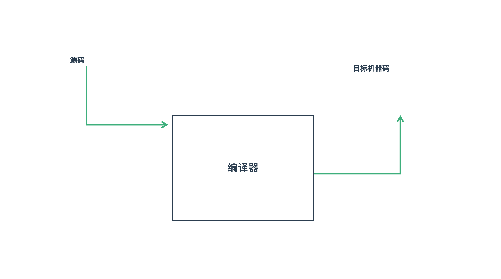
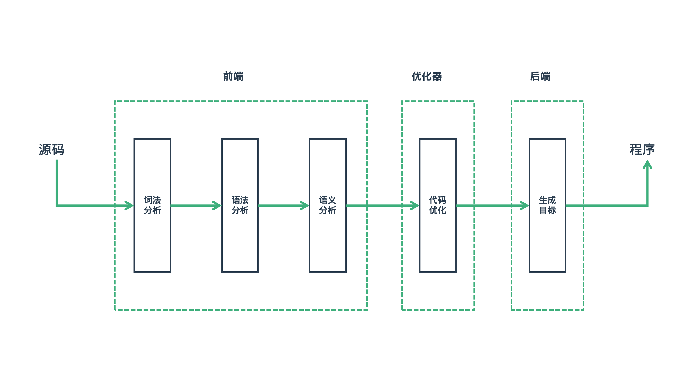
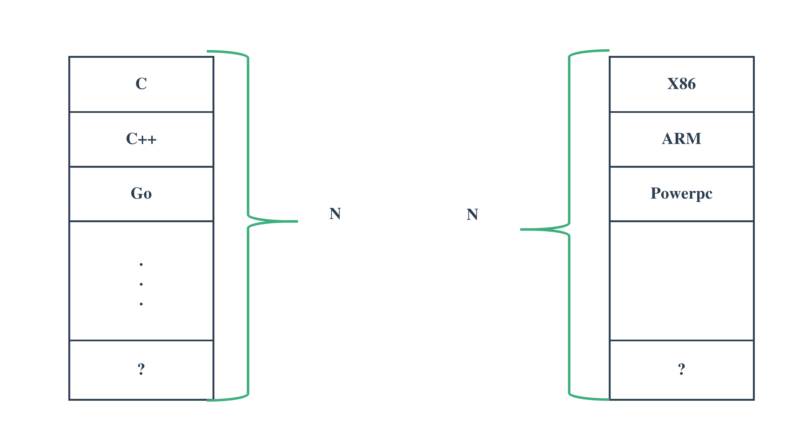

# 编译器的前后端

---

| 软件版本     | 硬件版本 | 更新内容 |
|--------------|----------|----------|
| linux 5.8.18 | X86      |          |

---

## 1.编译器的作用

编译器的作用说起来其实很简单就是把是把程序写的源码翻译成机器可以识别的机器码，如下图所示：

对于源码，是按照编程语言语法来组织的程序代码，可以是C，Python，C++等，机器码也是一样的可以有很多种硬件平台，可以是ARM平台，也可以是X86平台，那我们是不是需要对每种语言，每一种平台都实现一种编译器？是不是有些代码或者机制是可以复用的？答案是肯定，这也是我们下面要聊的将编译器划分为前后端的一个重要原因。

## 2.前后端之分

### 2.1 编译的阶段

编译的阶段可以分为词法解析，语法解析，语义分析，代码优化，生成目标几个阶段，为什么要分为几个阶段来进行，主要原因是源码处理是一步一步进行，而当前处理过程需要依赖上个过程的结果，如果上个过程发现源码存在问题，就应该停止并指出错误位置，待程序员解决问题之后再重新处理。

### 2.2 前后端划分

从上的图也可以看出，编译器其实划分为三个端，前端主要包括词法分析，语法分析，语义分析，中间一个段是优化器，再后面就是后端负责生成特定平台的目标代码。

### 2.3 划分的原因

#### 2.3.1 原因一：低偶合与高内聚

我们在软件工程相关的课程了解到程序设计要遵循的一条原则就是要做到低偶合高内聚，编译器是一种特殊的软件，但其特殊性是指它的工作内容比较特殊，而非编译器本身的代码比较特殊，本质上讲编译器也是一个应用程序。将编译器按功能划分为各个模块正是就是为了降低偶合，提高内聚，从而为功能的扩展与维护打好基础。

#### 2.3.2 原因二：代码复用

软件设计中，同样我们要追求代码复用。编译器的开发也是一样，我们在前编译器的作用中，也提到编译语言有很多种，而硬件平台同样也很多，而且未来还会有更多的语言和平台出现，为一种特定的编程语言在特定平台上的运行去开发一种特定的编译器显然是不合理的。

比如在x86平台上，我们可以运行C语言，C++，Go，而这些语言最终都是转化为X86平机制指令来运行的。所以只需要一个后端就可以了。同样的C语言可以运行在x86,ARM等各种硬件平台上，但是我们只需要开发一种C语言的前端就可以了。

#### 2.3.2 原因三：有效降低开发难度

把编译器划分前后端开发，这样前后端之间通过一些约定，可以使前端的开发人员不需要关注后端的技术，同样后端开发人员也只需要关注自己开发的部分，这样可以有效降低开发难度。

## 3.GCC与LLVM

这里将GCC与LLVM放在一起，其实是存在一些问题的，GCC是一个编译器套件，包括了编译过程的各个功能模块，而LLVM只是一个编译器后端，所以我认为合理的方式是GCC与Clang+LLVM，Clang是LLVM的前端。

### 3.1 GCC
GCC是由GNU开源组织开发的，是一级编译套间。发展到现在已经支持多种语言和多个硬件平台。

### 3.2 Clang+LLVM

LLVM是由编译器界的牛人Chris Lattner在学生时代完成的，到他博士时基本成熟，因为Apple对GCC的一些特性以及GCC对自家object-c的支持不是很完善，所以将Chris Lattner招入麾下，主持开发了Clang。

### 3.3 对比
|            | GCC  | CLang与LLVM  |
|------------|------|--------------|
| 速度       |      | 更快         |
| 内存       |      | 占用内存更少 |
| 错误信息   |      | 更完善可读   |
| 兼容性     |      | 更好         |
| 许可       | GPL  | BSD          |
| 应用范围   | 更广 |              |
| 代码复用性 |      | 更好         |

从上面的比对中也可以发现，Clang+LLVM目前更有优势，GCC的目前是有一些衰落的迹象，比如Android平台已经放弃GCC，转而使用Clang。至于工作如果选择，应该是由每多原因决定的。

## 4.小结

从上面的介绍只大家应该对编译器的前后端有了一些了解,对于这些东西，你知道或者不知道可能不会有太大的区别，本文也只是从宏观的角度聊一些基本的，常识性东西，希望对感兴趣的同学有所帮助。

---
::: tip 提示 

欢迎评论、探讨,如果发现错误请指正。转载请注明出处！ [探索者](http://www.tsz.wiki) 

:::

---
<Vssue :title="$title"/>
